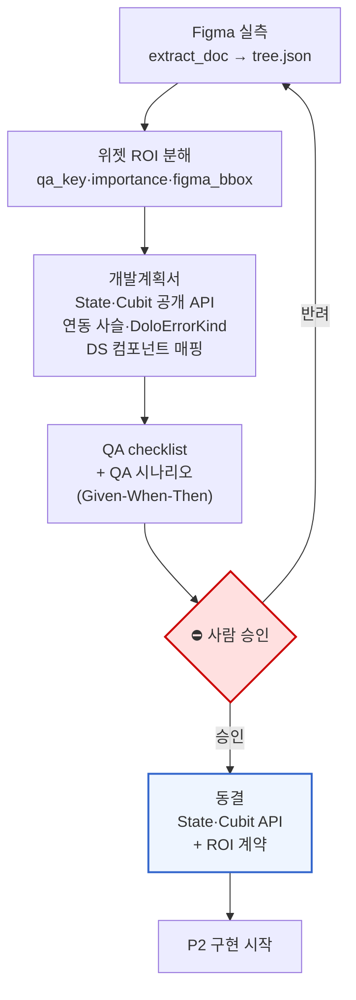
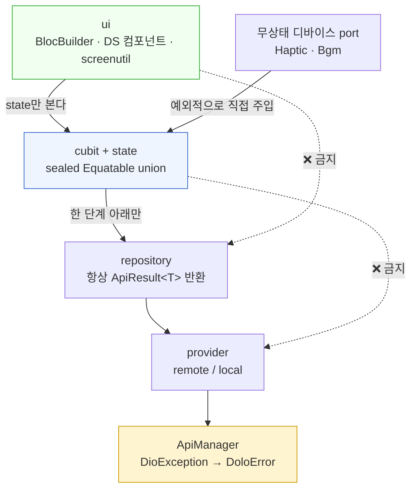
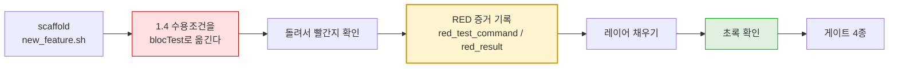
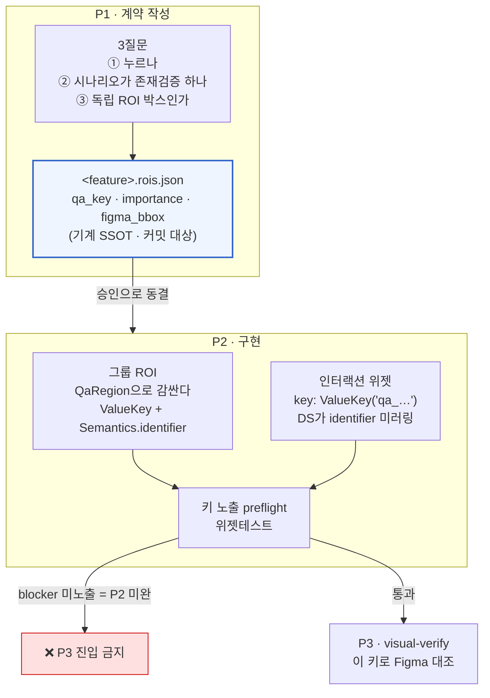
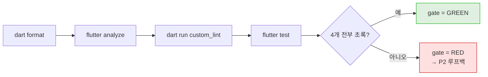
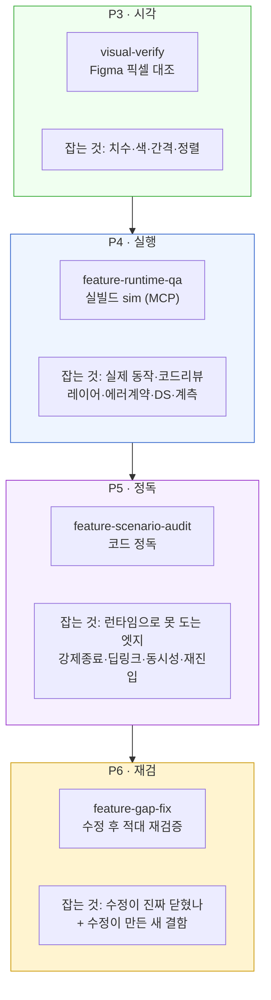
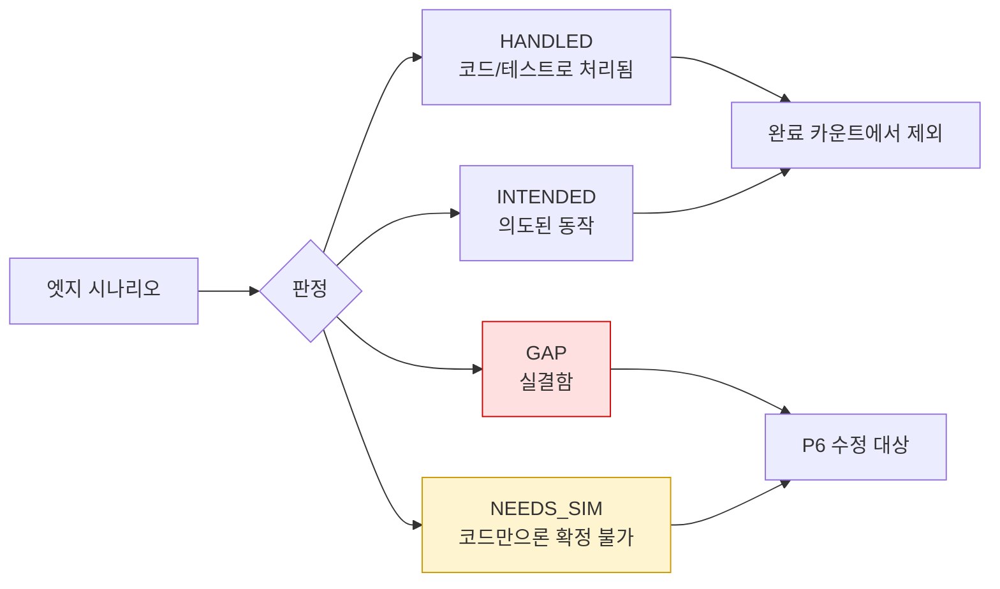
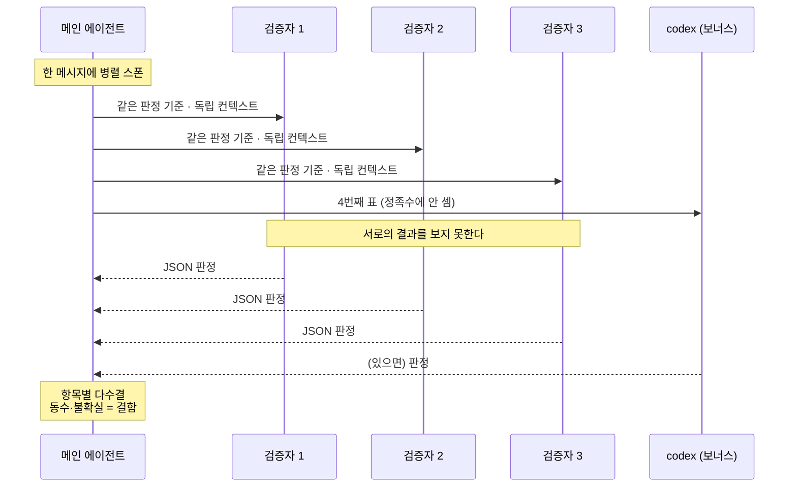
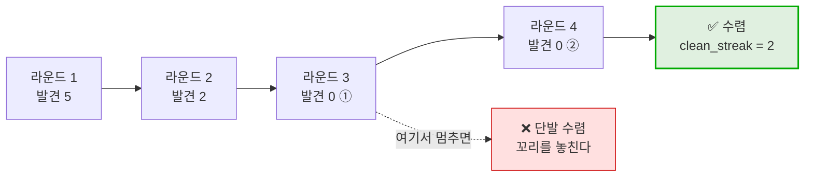
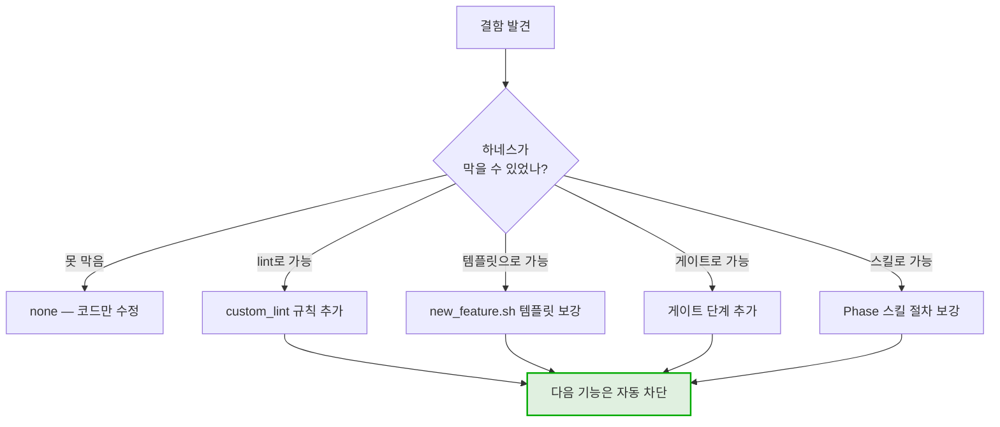

# 개발은 어떻게 하고, QA는 어떻게 하는가

[`loop-overview.md`](loop-overview.md)가 "루프가 어떻게 도는가"라면, 이 문서는
**한 단계 안에서 실제로 무슨 일이 벌어지는가**를 다룬다.

## 목차

1. [개발 — 계약을 먼저 얼리고 채운다](#1-개발--계약을-먼저-얼리고-채운다)
2. [레이어 규칙](#2-레이어-규칙)
3. [TDD — RED 증거가 없으면 미완](#3-tdd--red-증거가-없으면-미완)
4. [key-first — QA 키를 계획 단계에서 정한다](#4-key-first--qa-키를-계획-단계에서-정한다)
5. [게이트 4종](#5-게이트-4종)
6. [QA — 4중 검증 구조](#6-qa--4중-검증-구조)
7. [적대 검증 — 자기가 자기를 합격시키지 못한다](#7-적대-검증--자기가-자기를-합격시키지-못한다)
8. [수렴과 에스컬레이션](#8-수렴과-에스컬레이션)
9. [메타 루프 — 같은 결함을 두 번 만나지 않기](#9-메타-루프--같은-결함을-두-번-만나지-않기)

---

## 1. 개발 — 계약을 먼저 얼리고 채운다

이 프로세스의 개발관은 한 문장이다. **"코드를 짜기 전에 글로 못 박고, 사람이 승인하면 얼린다."**



동결의 의미는 강하다. 승인 후 State·Cubit 공개 API를 바꾸려면 **P1으로 돌아가 재승인**을
받아야 한다. UI 병행작업이 그 계약에 의존하기 때문이다.

**눈대중 금지가 명문화돼 있다.** 치수·색은 `extract_doc`가 뽑은 `tree.json` ground truth만
쓴다. 화면을 눈으로 보고 짐작한 숫자를 계획서에 넣는 것이 금지 대상이다.

**DS 매핑도 이 단계에서 끝낸다.** 필요한 UI 프리미티브마다 `component_registry.json`에서
교체 대상을 미리 적는다 — raw 위젯 재발명을 **설계 단계에서** 차단하고 P4 코드리뷰까지
미루지 않는다.

## 2. 레이어 규칙



| 규칙 | 내용 |
|---|---|
| **한 단계 아래만** | `ui`는 cubit state만, cubit은 repository만. provider·apimanager 직접 호출 금지 |
| **순수 Dart** | cubit·repository·provider·apimanager에 `package:flutter/…` import 금지 |
| **에러 계약** | `DioException → DoloError` 변환은 **ApiManager에만**. repository는 `ApiResult<T>`로 래핑 |
| **재진입 가드** | `if (state.isLoading) return;` — 실패 시 이전 데이터 보존 |
| **DS-first** | `SnackBar→DoloToast`, `Switch→DoloToggle`, `AlertDialog→DoloAlertDialog` |
| **토큰만** | 색·타이포는 `context.appColors`/`context.typography`. raw 값 금지 |
| **screenutil** | `ui/`에 raw px 금지. `.w/.h/.sp/.r` (Figma 375×812 기준) |
| **계측 격리** | `firebase_analytics` import는 `lib/core/telemetry/` 안에서만 |

## 3. TDD — RED 증거가 없으면 미완



**RED 증거를 문서에 남기는 것이 강제 조건이다.** 실행한 테스트 명령과 실패 출력 요약을
적지 않으면 P2를 ✅로 표시하지 못한다. TDD를 건너뛴 흔적이 남게 만든 장치다.

테스트에는 **성공 · 실패 · 재진입 가드** 세 경우가 반드시 들어간다.
버그를 고칠 때는 `@Tags(['regression'])`를 단 실패-우선 테스트를 붙인다.

## 4. key-first — QA 키를 계획 단계에서 정한다

이 프로세스에서 가장 특이한 설계다. **위젯 분해 = 키 부여 = ROI 정의 = 구현 단위**가
한 번에 1:1로 정해진다. 구현하다가 키를 붙이는 게 아니다.



| importance | 요구 조건 |
|---|---|
| `blocker` | `find.byKey` **와** `find.bySemanticsIdentifier` 둘 다 필수 → `QaRegion`으로 심어야 성립 |
| `normal` | `find.byKey`만 필수 (identifier는 권장) |

**키가 계약과 한 글자라도 다르면 P3 preflight FAIL.** 임의로 키를 발명하는 것이
금지 대상이고, 반대로 leaf·장식에 키를 남발하는 것도 금지다(화면당 8~20개가 감각).

## 5. 게이트 4종

```bash
dart format . && flutter analyze && dart run custom_lint && flutter test
```



`flutter analyze`와 `dart run custom_lint`는 **별개 단계**다. 하나만 돌리고 통과했다고
보면 안 된다. `// ignore:`로 lint를 우회하는 것도 금지(사유 주석 단 정당한 port 예외만).

## 6. QA — 4중 검증 구조

QA가 한 덩어리가 아니라 **성격이 다른 4개 층**으로 쪼개져 있다. 각 층이 잡는 결함이 다르다.



**P4와 P5는 상보 관계다.**

| | P4 런타임 | P5 코드 정독 |
|---|---|---|
| 신뢰도 | 높음 (실제로 돌려봄) | 중간 (읽어서 판단) |
| 범위 | 좁음 (안정 재현되는 것만) | 넓음 (전수) |
| 도구 | marionette > ios-simulator > dart MCP | Read · Grep만 |
| 파괴적 시나리오 | **실행 금지** → 위젯/cubit 테스트로 대체 | 정독만 |

P5의 판정 어휘는 4가지다.



**`NEEDS_SIM`은 병기가 아니라 완료를 막는 blocking count다.** "불확실은 결함 기본값"
원칙에 따라, 위젯/상태주입 테스트로 확정하기 전엔 그 기능을 완료로 넘기지 않는다.

## 7. 적대 검증 — 자기가 자기를 합격시키지 못한다

세 스킬 모두 같은 블록쿼트를 머리에 달고 있다.

> 자기 작업을 자기가 "됐다" 판정 금지 — 검증은 격리 에이전트 2~3 + codex 다수결(자평 금지).



검증자는 두 종류이고 권한이 다르다.

| | `isolated-adversarial-verifier` | `runtime-qa-verifier` |
|---|---|---|
| 쓰는 곳 | P5 · P6 | P4 |
| 권한 | **읽기 전용** (Read/Grep) | sim/MCP 구동, **Edit/Write 차단** |
| 근거 | 파일:라인 필수 | 조작 → 관찰 → 판정 |

**설계 원칙 하나가 중요하다.** 에이전트 파일에는 **불변 행동만** 담는다 — 격리·자평금지·
불확실=결함·근거 필수·읽기전용. Phase 고유의 판정 기준·출력 스키마는 **스킬이 소유**해서
task 프롬프트로 넘긴다. 그래야 같은 검증자를 여러 Phase가 재사용할 수 있다.

**축을 나눠 주지 않는다.** P4의 세 축(레이어·DS·계측)은 검증자 각자가 **전부** 본다.
축을 한 명씩 나눠 주면 항목별 검증자가 1명이 되어 "≥3 다수결"이 성립하지 않는다.

**한 명만 짚은 항목은 버리지 않는다** — 재확인 대상이고, 경험상 진짜 결함인 경우가 많다.

## 8. 수렴과 에스컬레이션



| 규칙 | 값 | 이유 |
|---|---|---|
| 정족수 | 독립 검증자 **≥3** 다수결 | 2명이면 동수가 자주 난다 |
| 동수·불확실 | **"결함" 기본값** | 놓치는 쪽보다 과검출이 안전 |
| 수렴 | 새 발견 없는 라운드 **2연속** | 1회는 우연일 수 있다 |
| 에스컬레이션 | 같은 루프 **3회** 초과 | 코드가 아니라 스펙·하네스 문제 신호 |

에스컬레이션이 뜨면 "더 열심히 고치기"가 아니라 **자동 반복을 멈추고 사람에게 올린다.**
같은 것을 세 번 고쳤는데 안 닫힌다면 대개 진단이 틀렸다는 뜻이다.

## 9. 메타 루프 — 같은 결함을 두 번 만나지 않기

이 프로세스에서 가장 값어치 있는 부분일 수 있다. 결함을 잡을 때마다 한 줄을 남긴다.

```
harness_feedback: none | lint | template | gate | skill
```



예시로 나와 있는 것 — "로딩 중 pop" 결함이 여러 기능에서 반복되자 화면마다 고치지 않고
`BusyPopGuard` 믹스인 + lint 규칙 하나로 묶었다. 이게 P6이 "루트 원인으로 묶어서 고친다"고
말하는 것의 실체다.

**컨벤션을 강제로 승격시키는 것**이 이 루프의 목표다. 문서에 "이렇게 하세요"라고 적힌 규칙은
지켜지지 않는다. 게이트가 막으면 지켜진다.
