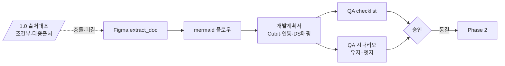
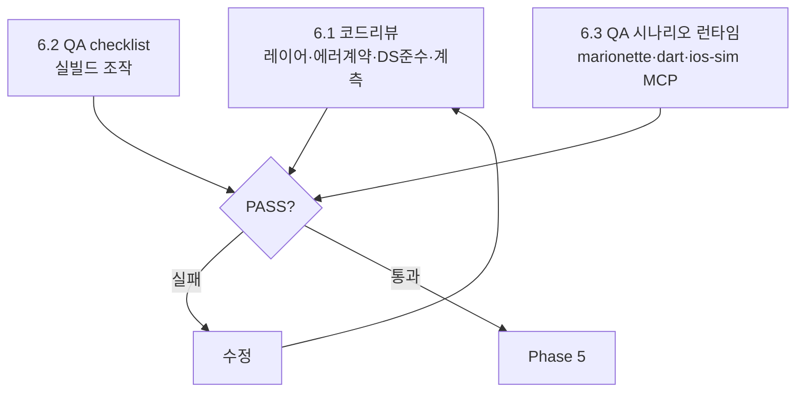
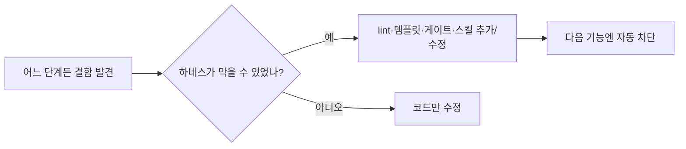

# 설정 화면 리뉴 — 개발 프로세스 명세

> 2026-07-01 정리(개정). 설정 9기능(계정·로그인정보·알림·공지·앱정보·의견·문의·앱잠금·회원탈퇴)을 BLoC/Cubit 레이어드로 다시 짜는 전 과정을 순서·산출물·게이트·유의점으로 모은다. 화면당 시각 검증의 단일 출처는 `screen-visual-verify-process.md`, 이해도 문서 형식은 `../understanding-doc-format.md`, 시나리오/갭은 `scenario-matrix.md`·`scenario-gaps.md`·`scenario-gaps-fix-plan.md`. 이 문서는 그 위를 잇는 상위 흐름이다.

## 0. 한눈에 — 전체 파이프라인

직선이 아니다. 각 검증 단계는 통과할 때까지 앞으로 되돌리는 피드백 루프를 가진다. 승인 반려는 계획으로, 게이트 실패는 구현으로, 시각 불일치·코드리뷰 반려는 수정으로, 시나리오 GAP 은 갭 수정으로 돌아가고, 닫혔는지는 다시 적대 검증으로 확인한다.

```mermaid
flowchart TD
  F[Phase 0 · 토대] --> P1

  subgraph P1[Phase 1 · 이해 · 계획]
    direction TB
    FG[1.1 Figma 기능 파악<br/>extract_doc 실측] --> FL[1.2 플로우 파악<br/>mermaid 화면전이·분기]
    FL --> DP[1.3 상세 개발계획서<br/>Cubit·State·연동대상·DoloErrorKind·DS매핑]
    DP --> QA[1.4 QA checklist + QA 시나리오<br/>유저 + 엣지]
  end

  P1 --> AP{사람 승인?<br/>State·Cubit API 동결}
  AP -->|반려| FG
  AP -->|승인| T[Phase 2 · TDD 구현<br/>RED→GREEN]
  T --> GATE{게이트 초록?<br/>format·analyze·custom_lint·test}
  GATE -->|실패| T
  GATE -->|통과| V[Phase 3 · 화면 시각검증]
  V --> CMP{Figma 일치?<br/>격리 ≥3 + codex(보너스)<br/>캡처 주석·위젯단위 다수결}
  CMP -->|불일치| FIX1[수정 에이전트 → codex 평가]
  FIX1 --> CMP
  CMP -->|일치| CR[Phase 4 · 코드리뷰 + 런타임 QA]
  CR --> CRG{PASS?<br/>DS준수 · QA체크리스트 ·<br/>QA시나리오 MCP 실빌드}
  CRG -->|실패| FIX2[수정]
  FIX2 --> CR
  CRG -->|통과| SC[Phase 5 · 시나리오 적대검증<br/>코드 정독 · 엣지 견고성]
  SC --> GAP{GAP 있음?}
  GAP -->|있음| FIX3[Phase 6 · 갭 수정 + 회귀테스트]
  FIX3 --> RV{재검증 PASS?<br/>격리 + codex}
  RV -->|GAP 잔존| FIX3
  RV -->|PASS| DONE
  GAP -->|모두 HANDLED/INTENDED| DONE[기능 완료]
  DONE -->|다음 기능| FG
  DONE -->|전 기능 끝| R[Phase 7 · PR / 릴리스]
```

기능 하나를 Phase 1→6까지 끝까지 돌린 뒤 다음 기능으로 넘어간다. 병렬로 여러 기능을 만지면 파일이 충돌하고 검증 맥락이 흐려져서 기능 단위 직렬이 원칙이다. 단 한 기능 안에서 독립적인 읽기·검증은 격리 에이전트로 동시에 돌린다.

루프 여섯: ① 승인 반려→계획 재작성, ② 게이트 실패→구현, ③ 시각 불일치→수정→재캡처, ④ 코드리뷰/런타임 QA 실패→수정, ⑤ 시나리오 GAP→갭 수정, ⑥ 재검증 미통과→다시 수정. 그리고 이 여섯 위를 가로지르는 **일곱 번째 메타 루프** — 어느 단계든 결함을 잡으면 하네스(lint·템플릿·게이트)로 되먹여 다음 기능에선 자동 차단되게 한다(§12). 루프의 정족수·종료·에스컬레이션 규칙은 §1b.

## 1. 관통 원칙 (모든 Phase에 적용)

- **자기 검증 금지, 적대 교차만 인정.** 내가 만든 걸 내가 "됐다"고 판정하지 않는다. 시각 비교·코드 리뷰·시나리오 검증 모두 격리 에이전트 ≥3과 codex(보너스) 를 적대로 붙여 다수결로 가른다. 한쪽만 잡은 항목이 대개 진짜 결함이다.
- **승인 게이트를 건너뛰지 않는다.** 계획서(State·Cubit 공개 API 동결), 전역 토큰 변경, reason 개수처럼 파급이 큰 결정은 구현 전에 사용자 승인을 받는다.
- **파괴적 액션은 실행하지 않는다.** 회원탈퇴 최종 제출은 QA 계정을 지우므로 sim·MCP 에서 누르지 않는다. 단계 전이는 위젯/cubit 테스트로만 본다.
- **범위는 부탁받은 만큼만.** 새 디바이스·도구·능동 작업으로 넓히기 전에 보고하고 멈춘다.
- **명시적 지시는 조용히 뒤집지 않는다.** 사용자가 콕 집은 요청(리터럴 값·동작)은 에이전트의 설계 의견·Figma 해석보다 위다. 구현·시안과 어긋나 보여도 혼자 override 하지 말고 **⛔BLOCK 으로 올려 확인**받는다. 명시 요청을 "의도된 staging·데이터 차이·디자이너 확인"으로 강등하거나 "이미 정상 ✅"으로 닫아 이견을 숨기지 않는다. 이는 위 "자기 검증 금지"의 연장 — 다툼 있는 결정을 자기가 옳다고 확정해 사용자 결정을 덮는 것도 자평이다. 수정요청 트리아지(예 `fix-requests-concretized.md`)의 항목 분류는 **`✅확정 / ❓결정필요 / ⛔이견`** 세 통이며, 사용자 리터럴 요청과 반대되는 no-change 는 `✅`로 닫을 수 없다. 요청 원문의 **모든** 불릿이 이 셋 중 하나로 계정돼야 한다. 사유·재발방지 = `rootcause-explicit-request-override-2026-07-03.md`.
- **게이트가 초록일 때만 끝.** `dart format . && flutter analyze && dart run custom_lint && flutter test`. analyze 와 custom_lint 는 별개 단계.
- **커밋은 요청 시에만, push 금지.** 작업 브랜치 `feat/settings`. Figma·QA 캡처 산물은 커밋 금지(.gitignore + /pr 0단계 정리).

### 1b. 검증 루프의 수렴 규칙 (loop engineering)

루프는 "돈다"로 끝이 아니라 언제 멈추고 언제 사람에게 올리는지가 규칙이어야 한다.
- **정족수.** 적대 검증은 독립 검증자 ≥3 중 다수결. 동수·불확실은 **'결함'으로 기본값**(놓치는 쪽보다 과검출이 안전). 자기 작업의 검증자에 자신을 넣지 않는다.
- **종료(수렴).** 시각·시나리오 루프는 **새 발견이 없는 라운드가 연속 2회**면 수렴으로 보고 종료한다(단발 1회로 "깨끗하다" 하지 않는다 — 꼬리를 놓친다). 갭 루프는 재검증이 GAP→HANDLED 로 뒤집히고 **회귀 테스트가 그 경로를 잠근** 순간 종료.
- **에스컬레이션.** 같은 루프를 N회(기본 3) 돌아도 안 닫히면 자동 반복을 멈추고 사람에게 올린다 — 코드가 아니라 스펙·하네스의 문제일 수 있다.

## 2. Phase 0 — 토대

기능 화면을 만들기 전에 앱 전체 배관을 깐다. 무조건 = 탭 셸·테마 구조, 조건부 = 캐시·애널리틱스·lint 인프라. UI 부품은 토대가 아니다. 다크모드는 구조만 올리고 light 고정(`context.appColors` 로만 짜서 나중 전환이 공짜). 상세는 `home-era-foundations` 메모리·FOUNDATIONS 백로그.

## 3. Phase 1 — 이해 · 계획 (승인 게이트)

화면을 짜기 전에 "무엇을, 어떤 구조로, 무엇이 맞으면 합격인지"를 글로 고정한다. (기획이 다중 출처면 1.0 출처 대조로 기준선을 먼저 맞추고) 네 단계가 차례로 다음 단계의 입력이 된다.

### 1.0 출처 대조 (조건부 — 다중 출처일 때만, 기본 스킵)
기획이 **Figma 말고도 별도 출처**(PM PDF·기획 문서 등)로 존재하고 어느 게 SSOT 인지 선언 안 됐을 때만 돈다. 단일 출처(설정 9기능처럼 Figma 하나)면 **건너뛴다**(순수 오버헤드). 산출은 작게 — 출처 우선순위(보통 갱신 Figma > 구 계획, 사용자 명시지시가 최우선) + 출처↔Figma 프레임 크로스워크 + **충돌·미결만**(일치는 안 적는다). 해소는 별도 표를 새로 만들지 말고 기존 SSOT(`ai_specs`·계획서·`rois.json`)에 흡수한다 — 위젯→DS 매핑을 여기 또 쓰면 1.3 과 이중 기록 = 드리프트. **Figma 가 갱신되면(프레임 증감) 이 대조를 델타만 다시 돌려**, 그게 이미 승인·동결된 계획의 가정을 흔드는지 본다(흔들면 ⛔ 재승인 대상). 예: `../emotion-conversation/figma-92-delta-reconciliation.md`(감정대화 63→92 재추출이 계획이 미룬 9~15 단계·가정 A2 를 재활성).

### 1.1 Figma 기능 파악
Figma 에서 이 기능의 화면·상태·인터랙션을 식별한다. 치수·색·간격은 `extract_doc` 로 실측해 추측을 없앤다. 무슨 화면이 있고, 각 화면이 어떤 상태(빈/로딩/성공/실패/권한거부 등)를 가지며, 어떤 탭이 무슨 동작을 일으키는지 목록화한다. 이어서 화면을 **위젯 단위로 분해하며 ROI·qa_key 를 먼저 부여**한다(key-first — 확정 산출은 1.3 의 rois.json).

### 1.2 플로우 파악 (mermaid)
1.1 의 화면들을 mermaid 로 잇는다. 화면 전이와 분기(성공→다음, 실패→토스트, 뒤로가기→폐기 등)를 그려, 사람이 한눈에 흐름을 검토할 수 있게 한다. 이게 이후 QA 시나리오의 뼈대가 된다.

### 1.3 상세 개발계획서 (Cubit · 연동 · DS 매핑)
무엇으로 만들지 못 박는다. 이해도 문서(`../understanding-doc-format.md` §1~§5)와 스펙(`ai_specs/<feature>.md`)에 다음을 적는다.
- **어떤 Cubit / State**: 기본 4(Initial/Loading/Success/Failure) + 기능별 변형, Cubit 공개 메서드 시그니처.
- **무엇과 연동하나**: repository → provider(remote/local) → apimanager 의 호출 사슬, 주입할 디바이스 port(Biometric/Haptic/Link 등), 외부 의존(OAuth·hive·permission), 호출할 엔드포인트.
- **발생 가능한 `DoloErrorKind`** 와 UI 의 `actionKind` 분기.
- **DS 컴포넌트 매핑**: 화면에 필요한 UI 프리미티브마다 `component_registry.json` 에서 매칭 entry(replacement)를 미리 적는다(없으면 새 DS 제안). 여기서 raw 위젯 재발명을 설계 단계에 차단한다.
- **위젯 ROI 키맵 (plan-time key-first)**: 화면을 위젯 단위로 분해하며 각 ROI 에 `qa_key`·`importance`·`figma_bbox`(실측)를 **먼저** 부여하고, 기능당 1개 `docs/renew-guide/impl/settings/<feature>.rois.json`(기계 계약, **커밋 대상**)으로 적는다. 이해도 문서 §3 표·번호박스 이미지는 이것의 뷰. 부여 기준·granularity 는 `understanding-doc-format.md §3`(3질문·group 기본·importance 승격). 이 키를 P2 가 `QaRegion` 으로 심고 P3 visual-verify 가 위젯-ROI 대조에 쓴다 — 1.4 QA checklist 의 `qa_*` 키와 **같은 네임스페이스**(이중 정의 아님).

### 1.4 QA checklist + QA 시나리오 작성
1.2 플로우와 1.3 계획서로부터 **검증 기준을 미리 쓴다**(나중에 Phase 4·5 에서 그대로 실행).
- **QA checklist**: 화면별 조작 점검표(이 버튼 누르면 이 화면, 이 토글 ON 이면 이 영역 펼침, 빈/에러 상태 렌더 등).
- **QA 시나리오**: 유저 시나리오(정상 사용 흐름) + 엣지 시나리오(강제종료·백그라운드 전환·네트워크 실패·권한 거부·재진입·딥링크)를 Given-When-Then 으로. `scenario-matrix.md` 가 이 산물의 모음.

→ **사람 승인.** State·Cubit 공개 API 동결. 승인 전엔 구현 시작 안 함.

### 1.5 ⚠️ 부분 승인 (P1-logic / P1-ui) — 레이아웃만 미확정일 때만

**기본은 통합 승인이다.** 아래는 **디자인이 아직 탐색 중이라 `rois.json` 을 물리적으로 못 쓰는 경우** 한정 예외다
(도입 근거 = 마이페이지 260715 — 시안 A/B 두 계열이 병존하고 harvest 도중 칩이 삭제되는 게 관측됨).

발동 조건 — **셋 다** 만족해야 한다. 하나라도 아니면 통합 승인으로 간다.
1. **레이아웃 미확정**이라 위젯 목록·`figma_bbox` 를 적을 수 없다(디자이너 탐색 중).
2. **데이터 계약은 확정 가능하다** — 시안 변형들이 *같은 데이터*를 다르게 배치할 뿐이다(값·출처·갱신이 동일).
3. 로직을 먼저 굳혀야 할 실익이 있다(예: 서버 API 미정 → 로직·경계가 계약을 지탱해야 함).

| 게이트 | 동결 대상 | 열리는 것 | 막히는 것 |
|---|---|---|---|
| **P1-logic** | Entity · State union · Cubit 공개 API · port 시그니처 · 실패 분류 | P2 의 **로직 절반**: model·provider·repository·cubit·mock·**bloc_test**·analytics 이벤트 | UI·위젯·골든 |
| **P1-ui** | `rois.json`(qa_key·importance·figma_bbox) · DS 매핑 | P2 의 **UI 절반** + **P3 visual-verify** | — |

규율:
- **P1-logic 승인서에 "무엇을 안 굳혔는지"를 명시**한다(미지수 목록 + 각각이 State 를 흔드는지 여부).
  State 를 흔들 수 있는 미지수가 남아 있으면 **그건 P1-logic 전에 답을 받는다** — 안 그러면 동결의 의미가 없다.
- **P3 진입 금지.** `rois.json` 이 P3 preflight 입력이라 없으면 FAIL 이다. P1-ui 승인 후에 P3.
- **레이아웃 확정 시 델타 재대조(§1.0)를 돌려** 그게 P1-logic 의 가정을 흔드는지 본다.
  흔들면 **P1-logic 재승인**(조용히 반영 금지 — §11 명시 요청 계약과 동일한 원칙).
- 진행판 P1 셀은 **P1-logic ✅ / P1-ui ⬜ 를 따로 적는다**(`approved` 컬럼도 `logic-only` 로).
  라우터는 P1-ui 가 ⬜ 인 동안 P3 로 못 넘어간다.
- ⚠️ **오용 경보**: "디자인이 좀 덜 나왔으니 일단 로직부터"는 조건 2를 안 보고 부르는 소리일 때가 많다.
  시안 변형이 *데이터*까지 다르면(필드 유무·집계 단위) 조건 2 불충족 → 통합 승인으로 돌아간다.



## 4. Phase 2 — TDD 구현

1. **스캐폴드.** `scripts/new_feature.sh <feature>`.
2. **테스트부터(RED).** 1.4 의 수용조건을 `blocTest` act/expect 로. 성공·실패·재진입 가드를 반드시 포함. 구현 전에 빨갛게.
3. **레이어를 채운다.** model → remote/local provider → repository → cubit(+state) → ui → module. 각 레이어는 한 단계 아래만 호출. JSON 모델 변경 시 `build_runner`.
4. **UI 는 DS 우선.** 1.3 에서 적은 DS 매핑대로 구현. raw 등가물 재발명 금지. 치수는 screenutil `.w/.h/.sp/.r`(375×812 기준). **상태는 cubit 우선·`setState` 지양** — 로컬 상태가 불가피하면 `ValueNotifier`+`ValueListenableBuilder`, `setState` 는 자식이 전부 StatelessWidget 일 때만(AGENTS.md 불변식).
5. **계측은 의미 있는 액션만.** cubit 성공/실패 분기에서 typed `AnalyticsEvent` track. 화면 진입은 observer 자동(새 `GoRoute` 엔 `name:`). PII·정신건강 자유텍스트 금지.
6. **키를 계약대로 심고 노출 preflight.** `<feature>.rois.json` 의 qa_key 를 그대로 — 그룹 ROI 는 `QaRegion`(`lib/core/qa/` — ValueKey+Semantics.identifier 미러링), 인터랙션 위젯은 기존 `ValueKey`(같은 키로 겹쳐 감싸기 금지). P2 끝 위젯테스트: **blocker 키 = `find.byKey`+`find.bySemanticsIdentifier` 둘 다**(QaRegion 전제), **normal 키 = `find.byKey` 만**(raw ValueKey 허용 — P3 라벨 폴백). blocker 미노출 = P2 미완, P3 진입 금지.
7. **배선 후 게이트.** module 을 `app.dart` 에 꽂고 게이트 초록(위 preflight 테스트 포함).

## 5. Phase 3 — 화면 시각 검증 (visual-verify)

단일 출처 `screen-visual-verify-process.md`. **기 개발된 화면과 Figma 가 어디가 다른지 위젯 하나하나** 본다.
Phase 1 산출 `<feature>.rois.json` 이 위젯-ROI 대조의 기계 계약 입력이다(visual-verify 가 `widget_roi_compare.py` 로 소비 — qa_key 정확일치 매칭, blocker 키 미노출 = preflight FAIL → P2 반려).

1. **캡처.** iPhone 16 Pro + QA토큰으로 화면을 상태별로(빈/로딩/성공/실패/펼침 등) 찍는다.
2. **실측을 옆에.** 같은 화면의 Figma `extract_doc` 치수·색을 둔다.
3. **stitch.** 좌 Figma · 우 구현으로 한 장에 붙인다(높이 정규화).
4. **적대 비교 + 캡처 주석.** 격리 에이전트 ≥3과 codex(보너스) 에게 자평 금지로 위젯 단위 비교를 시킨다. **다른 지점을 기 개발된 화면 캡처 위에 박스·번호로 표시**하고, 위치·치수·폰트·색·간격·상태·누락을 픽셀 #hex 실측과 함께 diff 표로 적는다. 다수결로 가린다(한 에이전트만 짚은 건 재확인).
5. **수정 핸드오프.** 주석 단 diff md 를 수정 에이전트에 넘긴다.
6. **codex 평가 → 재캡처.** 수정 후 codex 가 평가하고, 다시 찍어 재검증. 일치할 때까지 4~6 루프.

```mermaid
flowchart LR
  CAP[상태별 캡처] --> ST[좌Figma·우구현 stitch]
  ST --> CMP[격리 ≥3 + codex(보너스)<br/>위젯단위 적대비교]
  CMP --> ANN[캡처에 박스·번호 주석<br/>+ #hex diff 표]
  ANN --> D{불일치?}
  D -->|있음| FIX[수정 에이전트]
  FIX --> EV{codex 평가}
  EV -->|반려| FIX
  EV -->|OK| CAP
  D -->|없음| NEXT[다음 화면]
```

전역 파급(토큰 변경 등)은 화면에서 안 고치고 승인받아 전역으로 올린다. 데이터·환경·의도된 staging 차이는 결함이 아니므로 제외 기준(`sim-verify-6screens.md`)으로 분리. webview 화면(의견·문의 외부 링크)은 Figma 정합 대상 아님.

## 6. Phase 4 — 코드 리뷰 + 런타임 QA 검증

시안이 맞아도 코드 품질과 실제 동작은 따로 본다. 셋을 한 단계에서 적대로 검증한다.

### 6.1 코드 리뷰 (격리 에이전트 + codex)
- **레이어 경계·에러 계약**: ui 가 cubit state 만 보는지, 한 단계 아래만 호출하는지, DioException→DoloError 가 ApiManager 에만, `ApiResult` 래핑.
- **UI 의 design system 준수**: raw 색·타이포·치수 없이 토큰만, **프리미티브가 DS 컴포넌트(component_registry)로 구현됐는지**(SnackBar→DoloToast, Switch→DoloToggle 등 재발명 없음), 자산은 `Assets.*`/`AppIcons.*`, screenutil 치수.
- **계측 격리·네이밍**: `firebase_analytics` 가 telemetry 밖에 없는지, qa_/i18n 키 규칙, 새 `GoRoute` 의 `name:`.

### 6.2 QA checklist 실행
1.4 의 checklist 를 실제 빌드한 sim 에서 한 줄씩 조작해 확인한다. 통과/실패를 기록.

### 6.3 QA 시나리오 런타임 실행 (MCP 실빌드)
1.4 의 시나리오대로 **실제 빌드해서 동작을 확인**한다. 도구는 상황에 맞게 고른다.
- **ios-simulator MCP**: 좌표 탭·스와이프·스크린샷·요소 조회(블랙박스 조작·캡처).
- **dart MCP**: `flutter run`/`hot_reload`/위젯 트리·런타임 에러·로그(상태·트리 내부 관찰, 테스트 구동).
- **marionette MCP**: key(ValueKey)·텍스트로 위젯을 직접 탭·입력·스크롤·핫리로드(qa_* 키 기반 결정적 조작).
- 강제종료·백그라운드 전환 같은 lifecycle 시나리오는 `simctl`(terminate/launch, Device→Home)로 재현.
- **파괴적 시나리오(탈퇴 제출)는 실행하지 않는다** — 위젯/cubit 테스트로 대체.



## 7. Phase 5 — 시나리오 적대 검증 (코드 정독)

런타임으로 다 돌리기 어려운 엣지(강제종료 타이밍·딥링크·동시성)는 코드 정독으로 메운다. 기능별 격리 에이전트가 HIGH-risk + 완전성 비평 갭을 판정한다: HANDLED · GAP(실결함) · INTENDED(의도된 동작) · NEEDS_SIM(코드만으론 확정불가). 근거는 파일:라인. 산출 `scenario-gaps.md`. Phase 4 의 런타임 검증과 상보적이다(런타임=고신뢰·일부, 정독=광범위·전수).

## 8. Phase 6 — 갭 수정 / 회귀

`scenario-gaps-fix-plan.md` 를 따른다. GAP 을 루트 원인으로 묶고(여러 기능에 반복되면 공용 헬퍼·믹스인 한 번으로), 원본 `dolomood-app` parity 를 먼저 물어 회귀(이식)인지 신규 강화인지 가른 뒤, 우선순위대로 고친다. 데이터 손실·중복·오삭제·크래시가 위, 조용한 실패·정합이 아래. 버그를 고치면 실패부터 하는 회귀 테스트(`@Tags(['regression'])`)를 붙여 초록 확인. 닫혔는지는 적대 재검증으로(Phase 5 동형 재실행).

## 9. Phase 7 — PR / 릴리스

`/pr` 스킬로 base `dev` PR. 그 전 `scripts/clean_qa_artifacts.sh` 로 산물 정리 + `scripts/local_ci.sh` ALL GREEN(과금 방지로 Actions 수동 전용). QA 체크리스트 채우고 리뷰어 ALL-PASS 후 PR 박스 체크·머지.

## 10. 산출물 지도

| Phase | 산출물 | 위치 |
|---|---|---|
| 1.1~1.3 | 이해도 문서 · 승인 스펙 · **위젯 ROI 계약** | `impl/settings/<feature>.md` · `ai_specs/<feature>.md` · `docs/renew-guide/impl/settings/<feature>.rois.json`(커밋 대상 — gitignored 캡처류와 구분) |
| 1.4 | QA checklist · QA 시나리오 | `impl/settings/<feature>.md` §QA · `scenario-matrix.md` |
| 2 | 피처 코드 + bloc_test | `lib/feature/<feature>/` · `test/feature/<feature>/` |
| 3 | 시각 검증 기록(캡처 주석) | `sim-verify-*.md`, 캡처 `docs/designs/**`(gitignore) |
| 4 | 코드리뷰·런타임 QA 결과 | 검증 기록 md |
| 5 | 시나리오 갭 집계 | `scenario-gaps.md` |
| 6 | 갭 수정 계획·회귀 테스트 | `scenario-gaps-fix-plan.md` · `*_test.dart`(@regression) |

## 11. 도구 / MCP / 에이전트 규칙

- **격리 에이전트·codex** = 적대 검증의 두 축(시각 비교·코드 리뷰·시나리오 판정·parity 대조). 자평이 끼면 검증이 아니다.
- **워크플로우** = 여러 기능을 한 번에 펼쳐 검증할 때의 결정적 오케스트레이션(시나리오 컴파일·9기능 코드검증·parity fan-out).
- **런타임 MCP 3종**: ios-simulator(블랙박스 조작·캡처) · dart(상태·트리·테스트·로그) · marionette(key 기반 결정적 조작). 시나리오 성격에 맞게 고른다.
- **실재 스킬은 열여덟(18)** — 범용 5(`pr`·`figma-sync`·`humanize-korean`·`ga4-instrument`·`visual-verify`) + **설정 개발 7-Phase 루프 6**(`develop-looping-process` 오케스트레이터 + `feature-plan`(P1)·`feature-implement`(P2)·`feature-runtime-qa`(P4)·`feature-scenario-audit`(P5)·`feature-gap-fix`(P6); P3=`visual-verify`·P7=`pr` 재사용) + **그 외 7**(`deploy-dev`·`release`·`designer-handoff-report`·`design-system-handoff`·`regression-sync`·`sim-video-record`·`emotion-conversation-contract-drift`). 이 7-Phase 루프가 곧 본 문서를 스킬로 강제한 것 — 핸드오프는 진행판(**`develop-looping-process-state.json` SSOT + 생성 뷰 `develop-looping-process-status.md`**, `scripts/dlp.py` 로 라우팅/검증). 없는 스킬을 부르지 않는다.
- **에이전트 산출 jsonl 직접 tail 금지**(컨텍스트 폭주). 결과는 구조화 스키마·요약으로 받는다.

## 12. 하네스 엔지니어링 — 프로세스를 코드가 강제하게

이 문서가 "하라"고 적은 걸 사람이 안 빼먹게 만드는 건 글이 아니라 강제 장치다. 각 단계는 가능한 한 lint·스크립트·게이트·템플릿·레지스트리로 박아, 안 지키면 빌드나 PR 이 막히게 한다. 자동 차단(강제)과 코드리뷰로만 지키는 것(컨벤션)을 구분해 둔다 — 컨벤션은 결국 새는 자리라, 반복되면 강제로 승격한다.

| 프로세스 단계 | 강제 장치 | 안 지키면 | 종류 |
|---|---|---|---|
| 레이어 경계(ui→cubit→repo→provider→api) | custom_lint | 빌드 단계 실패 | 강제 |
| DS-first(raw 위젯 재발명 금지) | verify_ds_registry + custom_lint(후속) | 게이트 실패 | 강제(부분) |
| 자산 `Assets.*`/`AppIcons.*` | local_ci grep | 게이트 실패 | 강제 |
| analytics telemetry 격리 | custom_lint + local_ci grep | 빌드/게이트 실패 | 강제 |
| 새 GoRoute `name:`(screen_view) | require_goroute_name lint | 빌드 실패 | 강제 |
| i18n ko/en parity | make doctor / local_ci | 게이트 실패 | 강제 |
| 미디어 SDK 격리(core/media 밖 금지) | custom_lint + local_ci grep | 빌드/게이트 실패 | 강제 |
| 게이트 ALL GREEN 전 PR 금지 | /pr 스킬이 local_ci 강제 | PR 차단 | 강제 |
| main/dev 직접 push 금지 | pre-push 훅 | push 차단 | 강제 |
| 스펙 승인 전 구현 금지 | **dlp `I-A2`**(승인 없이 P2=pass 기록 시 validate FAIL) + `I-A`(승인 증거 요구) | 뮤테이션 거부 | **강제(dlp, 경유 시)** |
| 시각·시나리오 자평 금지 | **dlp `I-Q`**(P3/P4/P5 pass 는 SOUND 정족수 리뷰 증거 요구) | 뮤테이션 거부 | **강제(dlp, 경유 시)** |
| screenutil 치수(raw px 금지) | — | 코드리뷰 | 컨벤션 |

> **주의(강제 범위):** 위 두 dlp 강제는 **기능을 `develop-looping-process`(dlp)로 굴릴 때만** 문다 — 코드가 dlp 를 안 거치고 디스크에 존재하면 우회 가능(장부 강제는 opt-in). 완전한 하드강제(디렉토리↔승인트랙 CI 대조)는 후속(설계 §V8, 제어면 안정·마이그레이션 결정 안착 후). 그리고 dlp 의 리뷰 증거는 아직 '존재+정족수 신고'만 검사하고 검증자 신원·아티팩트 provenance 는 후속(review provenance 필수화, 백로그).

**메타 루프(7번째) — 결함을 하네스로 되먹인다.** 어느 단계든 결함을 잡으면 "코드만 고치고 끝"이 아니라 *이 결함을 하네스가 막을 수 있었나?* 를 묻는다. 막을 수 있었으면 lint·템플릿·게이트·스킬을 더해 **다음 기능에선 같은 결함이 안 나게** 한다(AGENTS.md: 같은 실수 반복 시 코드가 아니라 하네스를 고친다). 시나리오 갭의 공용 믹스인·헬퍼(BusyPopGuard·ResumeRefreshMixin 등)도 이 메타 루프의 산물 — 한 번 만들어 여러 기능의 같은 갭을 닫고, 가능하면 새 lint 로 재발까지 막는다(컨벤션→강제 승격).



이 표가 비어 있는 칸(컨벤션)이 다음 하네스 작업의 백로그다. **자평 금지·스펙 승인은 이미 dlp 증거층(`I-Q`/`I-A2`)으로 이동**(2026-07). 남은 컨벤션 잔여 = **screenutil raw-px lint**(예외 넓어 warning→gate 단계 승격), **DS raw-위젯 사용 lint**(`prefer_design_system_component` 실구현 — 기존 위반 수정과 함께 앱 워크트리에서), **하드 승인 강제**(feature 디렉토리↔승인 트랙 CI 대조, 제어면 안정 후). 강제로 못 올리는 것(setState 의미판정 등)은 P4 코드리뷰에 남긴다.
