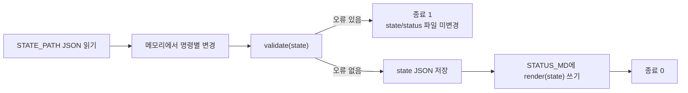
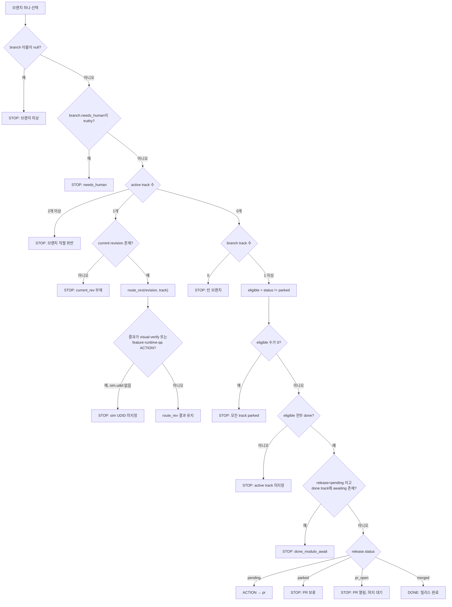
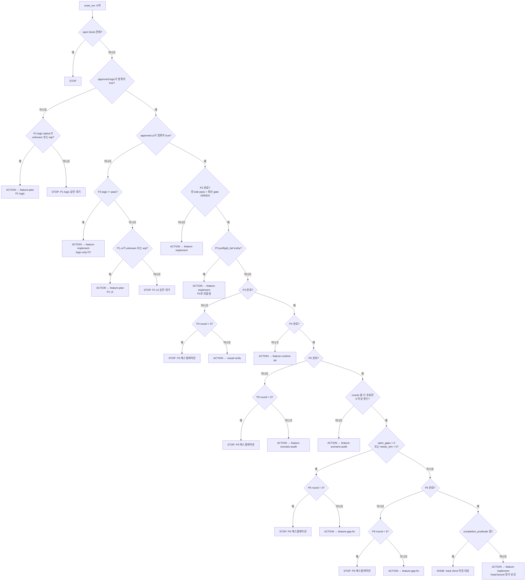
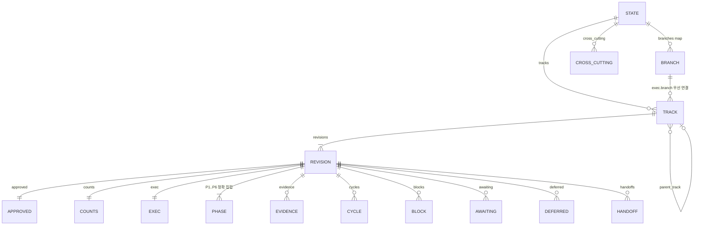

# `dlp.py` 도구 레퍼런스

이 문서는 `skills/develop-looping-process/scripts/dlp.py`의 실제 구현을 기준으로 작성했다. 명령 예시의 실행 파일 표기는 간단히 `dlp`로 줄였으며, 실제로는 `python3 skills/develop-looping-process/scripts/dlp.py`처럼 호출해야 한다.

## 목차

1. [종료 코드와 공통 동작](#1-종료-코드와-공통-동작)
2. [서브커맨드 전체 표](#2-서브커맨드-전체-표)
3. [뮤테이션 커맨드의 필수 필드와 거부 조건](#3-뮤테이션-커맨드의-필수-필드와-거부-조건)
4. [불변식](#4-불변식)
5. [`route` 판정 로직](#5-route-판정-로직)
6. [`completion_predicate`](#6-completion_predicate)
7. [상태 데이터 모델](#7-상태-데이터-모델)
8. [다른 저장소에서 사용할 때의 주의점](#8-다른-저장소에서-사용할-때의-주의점)
9. [`SKILL.md` 설명과 구현의 불일치](#9-skillmd-설명과-구현의-불일치)

## 1. 종료 코드와 공통 동작

### 종료 코드 규칙

| 상황 | 종료 코드 | 코드상 근거 |
|---|---:|---|
| 정상 완료 | `0` | 각 읽기 명령 및 성공한 `_apply()`가 `0` 반환 |
| `validate` 실패 | `1` | `cmd_validate()` |
| `route` 실행 전 검증 실패 | `1` | `cmd_route()` |
| `render --check` 드리프트 | `1` | 현재 status 파일과 `render(state)` 결과가 다를 때 |
| `selftest` 실패 | `1` | 실패 목록이 하나라도 있을 때 |
| 뮤테이션 후 전역 검증 실패 | `1` | `_apply()`가 파일을 저장하지 않고 `1` 반환 |
| 핸들러가 `SystemExit("메시지")`로 거부 | `1` | 없는 track/revision, 명령별 선행조건 실패 등 |
| CLI 문법 오류 | `2` | `argparse`의 기본 동작: 필수 인자 누락, `choices` 밖 값, 알 수 없는 옵션 등 |
| 코드의 dispatch에 도달했으나 처리되지 않은 명령 | `2` | `main()` 마지막 `return 2`; 현재 파서에 등록된 명령은 모두 앞에서 처리됨 |
| 파일 없음, JSON 파싱 실패, 쓰기 실패 등 잡히지 않은 예외 | 코드에서 고정하지 않음 | 예외 처리기가 없다. Python 프로세스는 비정상 종료하지만 이 도구가 특정 값을 명시하지는 않음 |

### 뮤테이션의 공통 트랜잭션



모든 뮤테이션은 `_apply()`를 통과한다. 명령별 변경 함수가 먼저 실행되고, 변경된 메모리 상태 전체에 `validate()`를 적용한다. 검증 오류가 있으면 `save_state()`를 호출하지 않는다.

단, 상태 저장 뒤 status 파일을 쓰는 순서이므로 **state 저장은 성공하고 status 쓰기만 실패하는 부분 성공**은 가능하다. 이 쓰기 오류를 되돌리는 코드는 없다.

또한 대부분의 track/revision 대상 명령은 다음을 공통으로 거부한다.

- `track` ID가 없으면 `track '<id>' 없음`
- 해당 track에 `rev` ID가 없으면 `track '<id>' 에 rev '<rev>' 없음`
- 변경 결과가 [불변식](#4-불변식)을 하나라도 깨면 `_apply()`가 종료 코드 `1`로 전체 변경을 거부

읽기 명령의 선행 검증은 서로 다르다. `route`만 명시적으로 `validate()`를 먼저 실행하고, `validate`는 검증 자체를 수행한다. `render`, `render --check`, `needs-human`, `audit`은 state 전체가 validator를 통과하는지 먼저 확인하지 않는다. `selftest`는 실제 운영 state 대신 함수 fixture와 임시 state를 사용한다.

## 2. 서브커맨드 전체 표

아래 표에는 `argparse`에 실제 등록된 30개 명령만 적었다. 대괄호는 선택 인자다.

| 이름 | 실제 파싱 인자 | 하는 일 | 정상/도구가 명시한 실패 종료 코드 |
|---|---|---|---|
| `validate` | 없음 | 현재 state 전체를 검증 | `0` / 검증 실패 `1` |
| `route` | 없음 | 먼저 state를 검증한 뒤 브랜치별 `ACTION`·`STOP`·`DONE` 출력 | `0` / 선행 검증 실패 `1` |
| `selftest` | 없음 | 함수 회귀 테스트와 임시 state를 사용한 CLI E2E 테스트 실행 | `0` / 테스트 실패 `1` |
| `render` | `[--check]` | 기본: status Markdown 생성·덮어쓰기. `--check`: 파일을 쓰지 않고 생성 결과와 기존 status 비교 | `0` / `--check` 불일치 `1` |
| `audit` | `[--source SOURCE] [--out OUT]` | 구 Markdown 보드를 읽어 마이그레이션 모순 리포트 작성 | `0`; 읽기·쓰기 등 예외 코드는 코드에서 고정하지 않음 |
| `set-phase` | `track rev {P1..P6} {pass,skip,unknown,wip} [--side {logic,ui}] [--clean-streak N] [--round N] [--preflight-fail] [--skip-reason {derived,norev,structural}]` | phase 상태와 일부 phase 메타데이터 변경 | `0` / 명령·검증 거부 `1`; 문법 오류 `2` |
| `set-counts` | `track rev --open-gaps N --needs-sim N` | `counts.open_gaps`, `counts.needs_sim` 설정 | `0` / 명령·검증 거부 `1`; 문법 오류 `2` |
| `approve` | `track rev [--logic] [--ui] [--by TEXT] --at TEXT [--rois-digest TEXT]` | logic/ui 승인 상태 및 approval evidence 기록 | `0` / 검증 거부 `1`; 문법 오류 `2` |
| `add-evidence` | `track rev kind` + 아래 별도 표의 옵션 | evidence 한 건 추가. 새 P2 GREEN head이면 하위 수렴 상태 일부 무효화 | `0` / 명령·검증 거부 `1`; 문법 오류 `2` |
| `add-cycle` | `track rev --phase TEXT [--found N] [--resolved N] [--remaining N] [--note TEXT]` | `cycles`에 순번을 붙여 한 건 append | `0` / 검증 거부 `1`; 문법 오류 `2` |
| `set-track-status` | `track {active,done,parked}` | track 상태 변경. `active`로 바꾸면 등록된 branch의 `needs_human`을 `null`로 설정 | `0` / 명령·검증 거부 `1`; 문법 오류 `2` |
| `mark-track-done` | `track` | 현재 revision이 완료 술어를 만족할 때만 track을 `done`으로 변경 | `0` / 완료 술어 미충족 등 `1` |
| `add-track` | `id --feature TEXT --title TEXT --branch TEXT [--rev TEXT] [--parent TEXT]` | `parked` 상태의 새 track과 기본 revision 골격 생성. branch가 없으면 release=`pending`으로 생성 | `0` / 중복·검증 거부 `1`; 문법 오류 `2` |
| `set-release` | `branch {merged,parked,pending,pr_open} [--pr N]` | branch의 release 상태와 선택적 PR 번호 설정 | `0` / 검증 거부 `1`; 문법 오류 `2` |
| `set-sim` | `branch udid [--device TEXT]` | branch의 simulator UDID와 선택적 device 설정 | `0` / 검증 거부 `1`; 문법 오류 `2` |
| `set-head` | `track rev head_commit` | `revision.exec.head_commit`을 입력 문자열로 설정 | `0` / 검증 거부 `1` |
| `capture-head` | `track rev` | `git rev-parse HEAD` 결과를 `exec.head_commit`에 설정 | `0` / dirty worktree·HEAD 획득 실패·검증 거부 `1` |
| `needs-human` | 없음 | route의 모든 STOP과 track별 block·awaiting·미확정 counts·미해결 질문·head 미포착을 Markdown으로 stdout에 출력 | `0`; 읽기 등 예외 코드는 코드에서 고정하지 않음 |
| `add-unknown` | `track rev --desc TEXT [--shakes-state]` | `approved.unknowns`에 resolution=`pending`인 질문 추가 | `0` / 검증 거부 `1`; 문법 오류 `2` |
| `resolve-unknown` | `track rev --desc TEXT [--resolution TEXT]` | 설명이 정확히 일치하는 첫 unknown의 resolution 변경. 기본값 `answered` | `0` / 대상 없음·검증 거부 `1` |
| `add-block` | `track rev --id TEXT --user-literal TEXT [--actor TEXT]` | status=`open`인 block 추가. actor 기본값은 `사람` | `0` / 검증 거부 `1`; 문법 오류 `2` |
| `resolve-block` | `track rev --id TEXT --resolution TEXT [--actor TEXT]` | ID가 정확히 일치하는 첫 block을 `resolved`로 변경 | `0` / 대상 없음·검증 거부 `1` |
| `add-await` | `track rev --desc TEXT --party {be,designer,user}` | `awaiting` 항목 추가 | `0` / 검증 거부 `1`; 문법 오류 `2` |
| `resolve-await` | `track rev --desc TEXT` | 설명이 일치하는 **모든** awaiting 항목 제거 | `0` / 검증 거부 `1`; 문법 오류 `2` |
| `add-deferred` | `track rev --desc TEXT --reason {followup,harness,intended} [--gate {be,designer,touch}]` | status=`deferred`인 deferred 항목 추가. gate 기본값은 `touch` | `0` / 검증 거부 `1`; 문법 오류 `2` |
| `add-handoff` | `track rev --from-ctx TEXT --to-ctx TEXT --at TEXT [--reason TEXT]` | `handoffs` 배열에 handoff 추가 | `0` / 검증 거부 `1`; 문법 오류 `2` |
| `add-cross-cutting` | `id [--title TEXT]` | 루트 `cross_cutting`에 status=`open`인 항목 추가 | `0` / 검증 거부 `1` |
| `close-cross-cutting` | `id --at TEXT` | ID가 정확히 일치하는 첫 cross-cutting 항목을 닫고 `closed_at` 기록 | `0` / 대상 없음·검증 거부 `1` |
| `set-needs-human` | `branch msg` | branch의 `needs_human` 문자열 설정. branch가 없으면 release=`pending`과 함께 생성 | `0` / 검증 거부 `1` |
| `clear-needs-human` | `branch` | branch의 `needs_human`을 `null`로 설정. branch가 없으면 release=`pending`과 함께 생성 | `0` / 검증 거부 `1` |

### `add-evidence`에서 파싱하는 전체 인자

`kind`는 다음 중 하나다.

`approval`, `gate`, `handoff`, `harness_feedback`, `live_e2e`, `merge`, `note`, `regression`, `review`

모든 kind에 공통으로 파싱되는 선택 옵션은 다음과 같다.

`--phase`, `--result`, `--commit`, `--head-commit`, `--command`, `--scope`, `--verdict`, `--device`, `--backend`, `--test-ref`, `--base`, `--mechanism`, `--note`, `--desc`, `--artifact-digest`, `--count`(정수), `--verifier-count`(정수), `--codex`, `--red-proven`

파서는 옵션과 kind의 조합을 제한하지 않는다. 예를 들어 `note --phase P4`도 파싱된다. 필수 필드와 일부 값 제약만 핸들러와 `validate()`가 검사한다.

## 3. 뮤테이션 커맨드의 필수 필드와 거부 조건

### 명령별 조건

| 명령 | 명령 자체가 요구하는 필드·조건 | 구체적 거부 조건 및 특이 동작 |
|---|---|---|
| `set-phase` | 위치 인자 4개. P1/P2에는 `--side logic\|ui` 필수 | P1/P2에서 side가 없으면 종료 `1`. P1/P2의 `skip`은 파싱되지만 전역 검증의 `I1-enum`으로 거부. P3/P4/P5/P6에 준 `--side`는 무시. `clean_streak`, `round`, `preflight_fail`, `skip_reason`은 split이 아닌 phase에서만 기록된다. 음수 streak/round는 `I1-type`. P4/P5의 skip은 `I1-skip`. P3 `preflight_fail=true`와 pass/skip 조합은 `I-PF`. P6 skip과 counts≠0/0은 `I-P6`. P2의 어느 side든 pass로 설정하면 P3의 `preflight_fail`을 삭제한다. |
| `set-counts` | 두 count 옵션 모두 필수. 최신 P5 review가 `SOUND`이며 `codex=true` 또는 `verifier_count≥3`이어야 함 | P5 리뷰 조건이 없으면 명령 자체가 종료 `1`. 음수 값은 파싱되지만 `I1-counts`로 거부. bool은 CLI 정수로 입력할 수 없으며, state 수동 입력 시 거부. P5 review의 head가 현재 head와 같은지는 이 명령이 검사하지 않는다. |
| `approve` | `--at` 필수. `--by` 기본값 `사람` | `--logic`과 `--ui`가 모두 없어도 거부하지 않고 `approved.by/at`만 기록. logic 승인 시 P1.logic=pass와 미해결 shakes-state 없음이 필요하고, ui 승인 시 P1.ui=pass 및 `--rois-digest`가 필요하다. 이 조건은 변경 후 `I-A`가 거부한다. `--ui` 없이 준 digest는 저장하지 않는다. 날짜 형식은 검사하지 않는다. |
| `add-evidence` | kind별 필수 필드는 아래 표 참조 | gate/review/live_e2e는 `--head-commit` 필수. review는 추가로 `--codex` 또는 `--verifier-count >= 3` 필수. enum·타입 위반은 전역 검증으로 거부. 새 head의 P2 GREEN gate는 P3~P5의 pass를 unknown으로, P6 pass/skip을 unknown으로 되돌리고 streak/round/skip_reason 및 counts를 일부 초기화한다. |
| `add-cycle` | `--phase` 필수. 숫자 옵션 기본값은 모두 `0`, note 기본값은 빈 문자열 | `phase` 값, 음수 count, 숫자들 사이의 산술 관계를 검증하지 않는다. 기존 `cycles`가 리스트가 아니면 append 중 예외가 날 수 있다. 현재 `validate()`는 cycles의 컨테이너/항목 shape를 완료 술어에서만 fail-closed로 보며, 별도의 `I1-type` 검사는 하지 않는다. |
| `set-track-status` | status choice 필수 | `done`은 `completion_predicate`가 거짓이면 즉시 거부. `active`는 같은 branch의 다른 active track 때문에 `I-B`가 생기면 전체 거부. active 설정 시 해당 branch가 이미 `branches`에 있을 때만 `needs_human=null` 처리. |
| `mark-track-done` | track 필수 | 현재 revision이 없거나 완료 술어가 거짓이면 `완료 술어 미충족`으로 거부. |
| `add-track` | `id`, feature, title, branch 필수. rev 기본값 `v1` | 중복 track ID는 즉시 거부. parent가 truthy인데 기존 track ID가 아니면 `I-P`. 새 track은 항상 parked, visual_exempt=false, counts=null/null로 생성된다. 빈 문자열의 의미 검증은 없다. |
| `set-release` | branch와 release status 필수 | status는 parser choice로 제한. `--pr`은 정수이기만 하면 되며 음수도 코드상 허용. status와 PR 존재 여부의 조합은 검증하지 않는다. |
| `set-sim` | branch, udid 필수 | UDID/device의 빈 문자열 여부·형식·실재성은 검증하지 않는다. 서로 다른 active branch가 같은 truthy UDID를 쓰면 `I-S`. |
| `set-head` | track, rev, head_commit 필수 | 빈 문자열은 일반 CLI 위치 인자로 전달 가능하며 validator는 문자열 타입만 검사하므로 저장될 수 있다. 커밋 해시 형식과 Git 실재 여부는 검사하지 않는다. 완료 술어는 비어 있는 head를 거짓으로 본다. 기존 downstream 상태를 무효화하지 않는다. |
| `capture-head` | track, rev 필수 | `git status --porcelain` 출력이 하나라도 있으면 거부. `git rev-parse HEAD` stdout이 비면 거부. Git 명령의 return code를 직접 검사하지 않는다. 획득한 head를 기록할 뿐 downstream 상태를 무효화하지 않는다. |
| `add-unknown` | desc 필수 | 중복 desc를 막지 않는다. `--shakes-state`를 주면 `true`, 없으면 `false`; resolution은 `pending`. 이미 logic 승인 상태에 shaking unknown을 추가하면 `I-A`로 거부된다. |
| `resolve-unknown` | desc 필수. resolution 기본값 `answered` | desc가 같은 첫 항목만 변경. 없으면 거부. resolution enum은 검사하지 않는다. 다만 logic 승인 상태에서 shaking unknown을 해소하려면 정확히 문자열 `answered`여야 `I-A`를 피한다. |
| `add-block` | id, user-literal 필수. actor 기본값 `사람` | ID 중복, 빈 문자열, actor 값은 검증하지 않는다. 추가 즉시 route는 해당 revision에서 STOP한다. |
| `resolve-block` | id, resolution 필수. actor 기본값 `사람` | ID가 같은 첫 block만 변경. 없으면 거부. resolution/actor의 형식·빈 값은 별도로 검증하지 않는다. |
| `add-await` | desc와 party 필수 | party는 parser choice로 제한. 중복과 빈 desc를 별도로 막지 않는다. awaiting은 revision 완료를 직접 막지 않지만, 모든 non-parked track이 done이고 release=pending이면 branch의 자동 `pr` ACTION을 STOP시킨다. |
| `resolve-await` | desc 필수 | 일치 항목이 없어도 성공한다. 일치하는 항목은 하나가 아니라 모두 제거한다. |
| `add-deferred` | desc와 reason 필수. gate 기본값 `touch` | reason/gate는 parser choice로 제한. deferred는 route와 완료 술어를 막지 않는다. 항목 내용에 대한 validator는 없다. |
| `add-handoff` | from-ctx, to-ctx, at 필수. reason 기본값 빈 문자열 | `handoffs`의 타입·항목·값을 validator와 `_wellformed()`이 검사하지 않는다. 날짜와 context 값 형식도 검사하지 않는다. |
| `add-cross-cutting` | id 위치 인자 필수. title 기본값 빈 문자열 | 중복 ID나 빈 ID를 막지 않는다. 생성되는 중첩 배열은 빈 dict 리스트다. |
| `close-cross-cutting` | id와 at 필수 | ID가 같은 첫 항목만 닫는다. 없으면 거부. `at` 형식은 검사하지 않는다. 이미 closed인 항목을 다시 닫는 것도 막지 않는다. |
| `set-needs-human` | branch와 msg 필수 | `msg`는 문자열이면 되며 빈 문자열도 저장 가능하다. route는 truthy 값일 때만 STOP하므로 빈 문자열은 STOP을 만들지 않는다. |
| `clear-needs-human` | branch 필수 | 없는 branch도 새로 만들고 release=pending, needs_human=null로 저장한다. |

### evidence kind별 필수 필드

| kind | 핸들러/validator 필수 필드 | 추가 제약 |
|---|---|---|
| `gate` | `phase`, `result`, `head_commit` | result는 `GREEN` 또는 `RED`. phase 값 자체는 `P2`로 제한되지 않음 |
| `review` | `phase`, `verdict`, `head_commit` | verdict는 `SOUND` 또는 `UNSOUND`; 명령 추가 시 `codex=true` 또는 verifier_count≥3 필요. 따라서 정족수를 충족한 UNSOUND도 유효한 evidence로 저장 가능 |
| `live_e2e` | `device`, `head_commit` | device/head가 빈 값이면 거부 |
| `approval` | `scope`, `actor` | **CLI에 `--actor`가 없으므로 `add-evidence approval`은 항상 필수 필드 누락으로 거부된다.** approval은 `approve` 명령으로는 생성 가능 |
| `regression` | `test_ref` | 내용 형식은 검사하지 않음 |
| `merge` | `base` | 내용 형식은 검사하지 않음 |
| `harness_feedback` | `desc` | 내용 형식은 검사하지 않음 |
| `note` | 없음 | 제공된 공통 옵션만 선택적으로 저장 |
| `handoff` | 없음 | 제공된 공통 옵션만 선택적으로 저장. `add-handoff` 명령이 쓰는 `revision.handoffs`와는 별도 저장소 |

evidence validator의 공통 추가 제약은 다음과 같다.

- kind는 위 9종만 허용한다.
- `verifier_count`가 있으면 bool이 아닌 정수이면서 0 이상이어야 한다.
- `codex`가 있으면 bool이어야 한다.
- `head_commit`이 있으면 문자열이어야 한다.
- gate/review/live_e2e는 `head_commit`이 필요하다. 단, 수동 state의 evidence에 `source="board-migration"`이 있으면 validator만 통과할 수 있다. `add-evidence` CLI에는 `--source`가 없으므로 이 예외를 만들 수 없다.
- `board-migration` 예외 evidence는 `_head_ok()`의 완료용 head 증거로 사용할 수 없다.
- review 완료 판정은 해당 phase의 **마지막 review evidence 하나만** 본다. 옛 SOUND 뒤에 최신 UNSOUND가 있으면 완료되지 않는다.

### 새 P2 GREEN gate의 무효화 범위

`add-evidence ... gate --phase P2 --result GREEN --head-commit NEW`에서 직전 P2 gate의 head와 새 head가 다를 때만 다음 변경을 먼저 수행한다.

| 대상 | 무효화 |
|---|---|
| P3, P4, P5 | status가 `pass`일 때만 `unknown`으로 변경 |
| P3, P4, P5 | `clean_streak`, `round` 삭제 |
| P6 | status가 `pass` 또는 `skip`이면 `unknown`으로 변경 |
| P6 | `skip_reason`, `round` 삭제 |
| counts | `open_gaps=null`, `needs_sim=null` |

P3가 `skip`이면 status는 유지된다. `preflight_fail`과 기존 evidence는 삭제하지 않는다. 직전 gate와 같은 head이면 위 무효화를 하지 않는다.

## 4. 불변식

`validate()`가 실제로 출력하는 식별자를 그대로 사용했다. `I1-*`도 코드상 오류 식별자이므로 함께 싣는다.

### 구조·타입·열거형

| 식별자 | 금지하는 상태 |
|---|---|
| `I1-type` | `tracks`가 리스트가 아님; track/phase/logic-ui/exec/counts/approved/blocks/awaiting/deferred/evidence/cross_cutting 및 일부 중첩 값의 잘못된 컨테이너 타입; `visual_exempt`·승인값·codex 등의 잘못된 스칼라 타입; head/branch/UDID의 비문자열; streak/round의 음수·bool·비정수 등 |
| `I1-dup` | 중복 track ID |
| `I1-enum` | track status, branch release status, phase status, skip_reason, block status, evidence kind 등이 허용 집합 밖인 상태. P1/P2 side의 `skip`도 이 코드로 금지 |
| `I1-skip` | P4 또는 P5를 `skip`으로 둔 상태. 상수에는 P1/P2도 포함되지만 split phase는 앞선 `I1-enum`으로 잡힘 |
| `I1-counts` | `open_gaps`·`needs_sim`이 `null` 또는 bool이 아닌 0 이상 정수가 아닌 상태 |
| `I1-branch` | 현재 revision의 `exec.branch`와 track의 `branch` 어느 쪽에도 branch가 없거나, 선택된 branch가 문자열이 아닌 상태 |
| `I1-rev` | `current_rev`와 같은 `rev` ID를 가진 revision이 없는 상태 |

### 상태 머신 불변식

| 식별자 | 금지하는 상태 |
|---|---|
| `I-PK` | current revision의 phase 키 집합이 정확히 `P1`~`P6`이 아님. 누락과 P7 등 여분 모두 금지 |
| `I-EV` | evidence kind별 필수 필드 누락; verifier_count/codex/head 타입 오류; review verdict 또는 gate result 오류; 신규 gate/review/live_e2e의 head 누락 |
| `I-M` | 어떤 phase가 pass인데 앞 phase가 `phase_done()` 기준으로 미완인 순서 역행. P2 양 side pass인데 최신 P2 gate가 GREEN이 아닌 상태도 포함 |
| `I-W` | 한 current revision 안에서 wip인 phase/side가 2개 이상 |
| `I-A` | 승인과 P1/증거의 모순: logic 승인인데 P1.logic 미통과 또는 logic approval evidence 없음 또는 미해결 shaking unknown 존재; ui 승인인데 P1.ui 미통과 또는 rois_digest 없음 또는 ui approval evidence 없음 |
| `I-A2` | P2.logic이 pass인데 logic 미승인, 또는 P2.ui가 pass인데 ui 미승인 |
| `I-Q` | P3/P4/P5가 pass인데 해당 phase의 최신 review가 SOUND 정족수를 충족하지 않음. 정족수는 `codex is True` 또는 bool이 아닌 `verifier_count >= 3` |
| `I-V` | P3가 skip인데 track의 `visual_exempt`가 정확히 bool `true`가 아님 |
| `I-PF` | P3 `preflight_fail`이 truthy인데 P3 status가 unknown/wip가 아님 |
| `I-P6` | P6가 skip인데 counts가 정확한 정수 `0/0`이 아님 |
| `I-C` | track status가 done인데 `completion_predicate`가 거짓 |
| `I-P` | truthy `parent_track`이 전체 track ID 목록에 없음 |
| `I-T` | `route_rev()`가 예외를 내거나 kind가 ACTION/STOP/DONE 중 하나가 아님 |
| `I-B` | 같은 branch에 active track이 2개 이상 |
| `I-S` | active track이 있는 서로 다른 branch들이 같은 truthy simulator UDID를 공유 |
| `I-X` | cross-cutting status가 open/closed가 아님 |

### validator가 검사하지 않는 주요 항목

다음은 스키마처럼 보이지만 코드에서 검증하지 않거나 부분적으로만 검증한다.

- `schema_version`의 존재·타입·값
- 루트 `branches`가 dict인지 여부: 비-dict이면 `_d()`가 빈 dict로 취급하며 별도 오류를 내지 않는다.
- 루트 state 자체가 dict인지 여부: dict가 아니면 `state.get(...)`에서 예외가 날 수 있다.
- current revision이 아닌 과거 revisions의 구조와 불변식
- track `id`의 존재·타입, `feature`, `title`, revision의 `rev` 타입·필수 여부·revision ID 중복. ID 중복만 `I1-dup`으로 검사한다.
- branch가 `branches` 맵에 실제 등록되어 있는지 여부
- P3 skip의 `skip_reason` 필수 여부와 structural/norev 제한
- cycle의 phase 값, 수치 범위, found/resolved/remaining 관계
- handoffs의 컨테이너와 항목 구조
- awaiting/deferred/unknown/cross-cutting의 대부분의 필드 존재·내용·중복
- block ID 중복, approval evidence의 scope enum
- evidence의 phase enum과 head의 Git 커밋 형식·실재성
- release status와 PR 번호의 일관성

## 5. `route` 판정 로직

CLI `route`는 먼저 `validate(state)`를 실행한다. 오류가 하나라도 있으면 실제 routing을 출력하지 않고 종료 `1`이다. 아래 로직은 검증된 상태에 대해 `route(state)`가 계산하는 순서다.

### 5.1 브랜치 단위 선택

브랜치 이름은 `state.branches`의 키와 track에서 계산한 branch의 합집합이다. track branch는 current revision의 truthy `exec.branch`를 우선하고, 없으면 `track.branch`를 사용한다.



`non_parked()`는 status가 parked가 아닌 모든 track을 반환한다. 즉 잘못된 status도 함수만 직접 호출하면 eligible이지만, CLI `route`에서는 validator가 먼저 막는다.

### 5.2 active revision의 `route_rev` 우선순위

다음 조건을 위에서부터 처음 만족하는 순간 하나의 결과를 반환한다.



세부적으로 다음 사항이 중요하다.

- open block은 다른 모든 revision 판정보다 우선한다.
- `approved_state()`는 승인값이 정확히 bool `true`인지 본다. 문자열 `"true"`는 승인으로 보지 않는다.
- logic-only 상태에서는 P2.logic pass까지 허용하지만 P2.ui로 직접 route하지 않는다. P2.logic이 pass이면 P1.ui 산출 또는 승인 대기로 간다.
- P3 완료는 pass+streak≥2+최신 SOUND 정족수 review이거나, `P3=skip`+`track.visual_exempt is True`다.
- P4 완료는 pass+최신 SOUND 정족수 review다.
- P5 완료는 pass+streak≥2+최신 SOUND 정족수 review다.
- round는 bool이 아닌 0 이상 정수가 아니면 helper에서 `0`으로 취급한다. CLI route 전 validator가 잘못된 타입을 막는다.
- 에스컬레이션은 `round > 3`, 즉 4 이상일 때다.
- P6가 이미 완료이면 round가 4 이상이어도 DONE 경로가 우선한다. P6 미완일 때만 round 에스컬레이션을 검사한다.
- route 결과가 P3/P4 실행 ACTION이면 branch의 truthy `sim.udid`가 추가로 필요하다. P5/P6에는 이 lease 검사가 없다.
- `I-T`는 `route_rev()`만 감싼다. 예를 들어 track ID 누락처럼 validator가 별도로 막지 않는 shape는 바깥 `route()`의 `t["id"]` 접근에서 예외를 낼 수 있으므로, 식별자까지 포함한 임의 손상 state 전체에 대한 총함수성은 코드에서 보장되지 않는다.

### ACTION·STOP·DONE의 의미

| kind | `skill` | 의미 |
|---|---|---|
| `ACTION` | 다음 스킬 이름 | 자동으로 다음 작업을 진행할 수 있는 판정 |
| `STOP` | 항상 `null` | 승인·사람 결정·block·에스컬레이션·직렬/lease 문제 등으로 정지 |
| `DONE` | `null` | active track revision이 완료 술어를 만족했거나, branch release가 merged |

`route_rev()`의 DONE은 track status를 직접 바꾸지 않는다. 별도로 `mark-track-done` 또는 `set-track-status ... done`을 실행해야 한다.

## 6. `completion_predicate`

완료는 다음 조건을 **모두** 만족할 때만 참이다.

```mermaid
flowchart LR
    W["완료 관련 구조 정상"] --> A["logic/ui 승인 true"]
    A --> P1["P1 양 side pass"]
    P1 --> B["open block 없음"]
    B --> C["counts = 정수 0/0"]
    C --> P2["P2 양 side pass<br/>최신 gate GREEN"]
    P2 --> P3["P3 완료"]
    P3 --> P4["P4 완료"]
    P4 --> P5["P5 완료"]
    P5 --> P6["P6 pass 또는<br/>skip+counts 0/0"]
    P6 --> H["head-bound 증거 일치"]
    H --> DONE["completion_predicate = true"]
```



정확한 조건은 다음과 같다.

1. `_wellformed(rev)`가 참이어야 한다.
   - `rev`, `phases`, 각 phase node와 P1/P2 side node가 요구 타입이어야 한다.
   - `exec`, `counts`, `approved`가 있으면 dict여야 한다.
   - `exec.branch/head_commit`이 있으면 null 또는 문자열이어야 한다.
   - count가 있으면 null 또는 bool이 아닌 정수여야 한다. `_wellformed()` 자체는 음수까지 막지는 않지만 뒤의 0/0 조건이 막는다.
   - approved logic/ui가 있으면 bool이어야 한다.
   - blocks, awaiting, deferred, evidence, cycles가 있으면 dict 항목만 담은 리스트여야 한다.
2. `approved.logic is True`이고 `approved.ui is True`여야 한다.
3. P1.logic과 P1.ui status가 모두 pass여야 한다.
4. open block이 없어야 한다. block status가 생략되면 open으로 취급한다.
5. `open_gaps`와 `needs_sim`이 각각 bool이 아닌 정수 `0`이어야 한다. null, `false`, `0.0`, 문자열 `"0"`은 실패한다.
6. P2~P6가 모두 `phase_done()`이어야 한다.
   - P2: logic/ui 모두 pass이고 마지막 P2 gate의 result가 GREEN
   - P3: pass+clean_streak≥2+마지막 P3 review 정족수 SOUND, 또는 skip+track.visual_exempt가 정확히 true
   - P4: pass+마지막 P4 review 정족수 SOUND
   - P5: pass+clean_streak≥2+마지막 P5 review 정족수 SOUND
   - P6: pass, 또는 skip+counts가 정수 0/0
7. `_head_ok(rev)`가 참이어야 한다.
   - `exec.head_commit`이 비어 있지 않은 문자열
   - 마지막 P2 gate의 `head_commit`이 위 head와 동일
   - P3/P4/P5 중 status가 skip이 아닌 각 phase의 **마지막 review**가 정족수 SOUND이며 그 `head_commit`도 동일

P3가 skip이면 `_head_ok()`에서 P3 review를 요구하지 않는다. P4/P5는 validator가 skip을 금지하므로 정상 state에서는 항상 review와 head 일치가 필요하다.

`completion_predicate`가 직접 요구하지 않는 것은 다음과 같다.

- awaiting과 deferred가 비어 있을 것
- cycles가 하나 이상 있을 것
- release가 특정 상태일 것
- track status가 active일 것
- `skip_reason`이 있을 것
- approval evidence와 rois_digest가 있을 것

마지막 네 항목 중 approval evidence와 rois_digest는 `completion_predicate` 자체가 아니라 validator의 `I-A`가 강제한다. 따라서 함수를 단독 호출한 결과와 검증된 state에서의 실질 완료 조건은 구분해야 한다.

## 7. 상태 데이터 모델

### 관계



### 루트와 branch

| 경로 | 코드가 기대하거나 생성하는 값 |
|---|---|
| `schema_version` | selftest/add-track 전제 state에서는 `1`; validator는 존재·값을 검사하지 않음 |
| `branches` | branch 이름을 키로 하는 object를 사실상 기대. 루트 타입 검사는 없음 |
| `branches.<name>.release.status` | 필수로 검증됨: `pending`, `parked`, `pr_open`, `merged` |
| `branches.<name>.release.pr` | 선택 정수로 CLI가 생성; validator 제약 없음 |
| `branches.<name>.sim.udid` | 선택 null 또는 문자열. active branch끼리 truthy 값 중복 금지 |
| `branches.<name>.sim.device` | 선택 문자열로 CLI가 생성; validator 제약 없음 |
| `branches.<name>.needs_human` | 선택 null 또는 문자열. truthy 문자열이면 route STOP |
| `tracks` | track object의 리스트 |
| `cross_cutting` | 선택 리스트. 항목은 dict여야 함 |

### track과 revision

| 경로 | 코드가 기대하거나 생성하는 값 |
|---|---|
| `track.id` | track 식별자. validator는 중복만 금지하며 존재와 타입은 검사하지 않음 |
| `track.feature`, `track.title` | `add-track`이 문자열 인자에서 생성하나 validator는 검사하지 않음 |
| `track.branch` | fallback branch. current revision의 truthy `exec.branch`가 우선 |
| `track.parent_track` | 선택 ID. truthy이면 실제 track ID여야 함 |
| `track.status` | `active`, `parked`, `done` |
| `track.visual_exempt` | 선택 bool. P3 skip 완료에는 정확히 true 필요 |
| `track.current_rev` | `revisions[].rev` 중 현재 revision을 고르는 값 |
| `track.revisions` | revision 리스트로 사용하지만 리스트 타입 자체와 과거 revision은 validator가 완전 검사하지 않음 |
| `revision.rev` | revision ID. current_rev와 equality 비교 |
| `revision.exec.branch` | truthy이면 track.branch보다 우선 |
| `revision.exec.head_commit` | 선택 문자열. 완료에는 비어 있지 않은 값 필요 |
| `revision.approved.logic/ui` | bool 승인값 |
| `revision.approved.rois_digest` | ui 승인 시 validator가 truthy 값을 요구 |
| `revision.approved.by/at` | `approve`가 기록. validator 제약 없음 |
| `revision.approved.unknowns[]` | `{desc, shakes_state, resolution}` 형태로 명령이 생성. shaking 질문은 logic 승인 상태에서 resolution=`answered`가 아니면 금지 |
| `revision.counts.open_gaps/needs_sim` | 각각 null 또는 bool이 아닌 0 이상 정수 |

### phase

current revision의 `phases` 키는 정확히 `P1`~`P6`이어야 한다.

| phase | 구조와 완료 조건 |
|---|---|
| `P1` | `{logic:{status}, ui:{status}}`; side status는 unknown/wip/pass만 허용 |
| `P2` | `{logic:{status}, ui:{status}}`; side status는 unknown/wip/pass만 허용. 완료에는 마지막 P2 gate GREEN 필요 |
| `P3` | `{status, clean_streak?, round?, preflight_fail?, skip_reason?}`; pass 완료에는 streak≥2+review, skip 완료에는 visual_exempt=true |
| `P4` | `{status, ...}`; pass+review만 완료. skip 금지 |
| `P5` | `{status, clean_streak?, round?, skip_reason?}`; pass+streak≥2+review. skip 금지 |
| `P6` | `{status, clean_streak?, round?, skip_reason?}`; pass 또는 counts 0/0에서 skip이면 완료 |

상태 집합은 unknown/wip/pass/skip이다. P1/P2는 skip 금지이며, P4/P5도 skip 금지다. P3/P6만 정상 검증 상태에서 skip이 가능하다.

### 반복·증거·미결 데이터

| 경로 | 명령이 만드는 구조 / 검증 범위 |
|---|---|
| `revision.evidence[]` | `{kind, ...typed payload}`. kind와 일부 필수 필드·타입·enum을 검증 |
| `revision.cycles[]` | `{n, phase, found, resolved, remaining, note}`. `n`은 append 직전 길이+1. 내용 검증 없음 |
| `revision.blocks[]` | `{id, user_literal, status, actor, resolution?}`. status는 open/resolved/superseded |
| `revision.awaiting[]` | `{desc, party}`. 컨테이너/항목 dict 여부 외 내용 검증 없음 |
| `revision.deferred[]` | `{desc, reason, gate, status:"deferred"}`. 컨테이너/항목 dict 여부 외 내용 검증 없음 |
| `revision.handoffs[]` | `{from_ctx, to_ctx, at, reason}`. validator 검사 없음 |
| `cross_cutting[]` | `{id, title, status, evidence, carry_items, deferred, closed_at?}`. status와 세 중첩 배열의 dict-list shape만 검증 |

## 8. 다른 저장소에서 사용할 때의 주의점

### 경로가 스킬 디렉터리 아래로 하드코딩됨

코드는 다음처럼 위치를 계산한다.

```text
ROOT = dlp.py의 부모(scripts)의 부모
_D = ROOT/docs/renew-guide/impl/settings
```

현재 파일 위치에서는 기본 경로가 다음처럼 된다.

```text
skills/develop-looping-process/docs/renew-guide/impl/settings/
```

그러나 이 저장소에는 해당 디렉터리와 기본 state 파일이 없다. 실제 `references/` 아래에 설계 문서가 있다는 사실을 `dlp.py`는 사용하지 않는다. 따라서 환경변수를 지정하지 않으면 `validate`, `route`, 대부분의 뮤테이션은 기본 state를 열다가 실패하고, render/status 쓰기도 부모 디렉터리가 없어 실패할 수 있다.

| 목적 | 코드상 기본값 | 우회 가능 여부 |
|---|---|---|
| state | `_D/develop-looping-process-state.json` | `DLP_STATE` 환경변수 |
| 생성 status | `_D/develop-looping-process-status.md` | `DLP_STATUS` 환경변수 |
| audit report | `_D/develop-looping-process-migration-report.md` | `audit --out` |
| 보존 원본 | `_D/dlp-notes/_original-status-260724.md` | 직접 옵션 없음. 파일이 없으면 audit 기본 source가 Git HEAD 경로로 바뀜 |

### Git 저장소 전제

- `capture-head`는 `cwd=ROOT`에서 `git status --porcelain`과 `git rev-parse HEAD`를 실행한다.
- Git은 상위 디렉터리의 저장소를 찾으므로 현재 배치에서는 Flutter 프로젝트가 아니라 **`custom_skills` 저장소의 HEAD와 dirty 상태**를 볼 수 있다.
- dirty 검사는 저장소 전체의 tracked/untracked 변경을 본다. 대상 앱과 무관한 변경도 capture를 막는다.
- `audit`의 `git:<ref>:<path>` 입력도 `cwd=ROOT`에서 `git show`를 실행한다. 기본 fallback 경로는 `docs/renew-guide/impl/settings/develop-looping-process-status.md`로 고정되어 있다.
- `git show` 실패의 return code를 검사하지 않고 stdout만 사용한다. 실패하면 빈 텍스트가 audit에 들어가 “표 헤더 못 찾음” 리포트가 생성될 수 있다.

### 상태 초기화 명령이 없음

`add-track`은 기존 state를 먼저 `load_state()`한다. 빈 저장소에서 state 파일 자체를 만드는 `init` 서브커맨드는 없다. 최소 루트 구조를 누가 어떻게 생성해야 하는지는 코드에서 확인되지 않는다. selftest의 seed는 `schema_version`, `branches`, `tracks`, `cross_cutting`을 사용하지만 이는 CLI 초기화 기능이 아니다.

### 실행 위치와 문서 문자열

- `SKILL.md`는 `python3 scripts/dlp.py` 호출을 제시하지만, 이 저장소 루트에서는 실제 경로가 `skills/develop-looping-process/scripts/dlp.py`다.
- render 결과 안에도 `python3 scripts/dlp.py`와 원래 프로젝트의 status 파일명이 고정 문구로 들어간다.
- `dlp.py` 상단 주석이 가리키는 설계 정본 경로도 `_D` 계열인 `docs/renew-guide/impl/settings/...`이며 현재 스킬의 `references/dlp-state-machine-design.md`를 참조하지 않는다.

### 기타 전제

- JSON 파일 인코딩은 UTF-8이다.
- 표준 라이브러리만 import한다.
- 파일 잠금이나 동시 쓰기 방지는 없다.
- state 저장은 임시 파일+rename 방식이 아니라 대상 파일을 바로 `"w"`로 연다.
- revision 추가·전환 명령은 없다. `add-track`이 첫 revision 하나만 생성한다.
- head를 바꾸는 `set-head`/`capture-head`와 새 gate의 downstream 무효화는 결합되어 있지 않다. 무효화는 오직 `add-evidence`로 **다른 head의 P2 GREEN gate**를 추가할 때 일어난다.

## 9. `SKILL.md` 설명과 구현의 불일치

아래는 같은 스킬의 `SKILL.md` 문구를 `dlp.py`와 대조해 확인한 차이다.

| 주제 | `SKILL.md` 설명 | `dlp.py` 실제 구현 |
|---|---|---|
| 서브커맨드 목록 | 뮤테이션 목록에 주요 명령을 열거 | `capture-head`, `needs-human`, `add-unknown`, `resolve-unknown`도 실제 파서에 있으나 해당 목록에서 빠져 있음 |
| 검증 정족수 | 상단 정책은 “격리 에이전트 2~3 + codex 다수결”이라고 설명 | `_review_ok()`는 `codex is True` **하나만으로도** 통과시키거나, codex 없이 `verifier_count >= 3`이면 통과시킴. 다수결이나 2명+codex 결합을 계산하지 않음 |
| P3 skip reason | 코드 주석과 SKILL의 설계 맥락은 structural/norev 면제를 시사 | validator는 P3 skip에서 `visual_exempt is True`만 강제. skip_reason은 없어도 되고, 있으면 공통 집합의 `derived`도 허용 |
| 새 P2 gate의 하위 무효화 | “새 P2 gate가 찍히면 P3~P6 pass를 자동 무효화” | **P2 GREEN이며 이전 P2 gate와 head가 다를 때만** 동작. P3~P5는 pass만 unknown으로 바꾸고 P3 skip은 유지. P6는 pass와 skip을 unknown으로 변경 |
| 사이클 렌더링 | `render`가 “사이클 롤업·라운드별 상세를 뷰로 뽑는다”고 설명 | `render()`는 `cycles`를 읽어 출력하지 않음. `needs_human_report()`도 cycles를 출력하지 않음 |
| evidence 지원 | `add-evidence`가 승인 증거를 포함한 kind별 증거를 append한다고 설명 | parser가 `approval` kind를 받지만 필수 `actor` 옵션을 파싱하지 않아 `add-evidence approval`은 항상 거부. `approve`만 approval evidence를 정상 생성 |
| 기본 SSOT 위치 | 저장소 루트의 `docs/renew-guide/impl/settings/...`를 SSOT로 설명 | 코드의 `ROOT`는 스킬 디렉터리이므로 현재 배치에서 기본값은 `skills/develop-looping-process/docs/renew-guide/impl/settings/...` |
| 완료 조건 요약 | P3 “streak≥2 또는 skip”으로 요약 | skip은 아무 skip이 아니라 `track.visual_exempt is True`가 필요. 전체 완료에는 최신 P2 gate와 P3/P4/P5 최신 review가 `exec.head_commit`과 일치해야 함 |

이 표에 적지 않은 설계 의도나 원래 Flutter 프로젝트의 상태 파일 스키마는 `dlp.py`에서 확인되지 않으므로 이 문서에서 추정하지 않았다.
