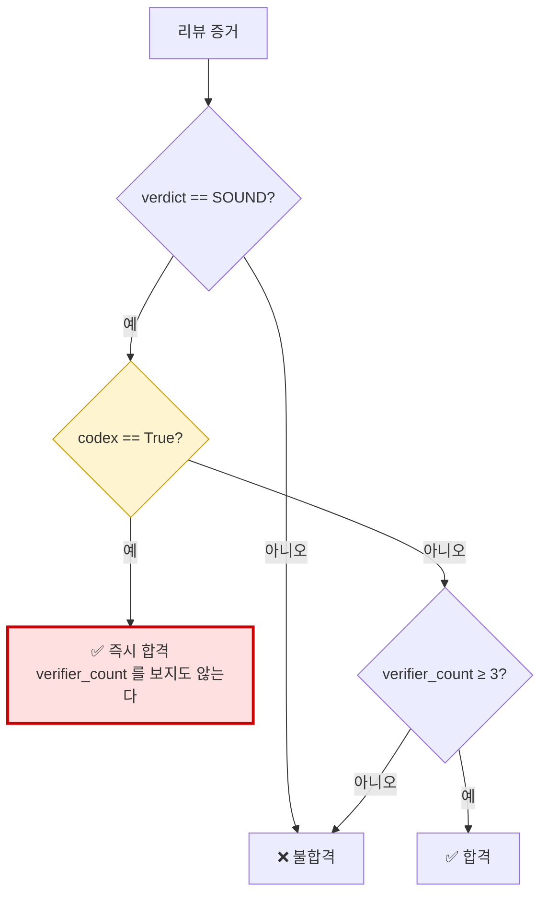
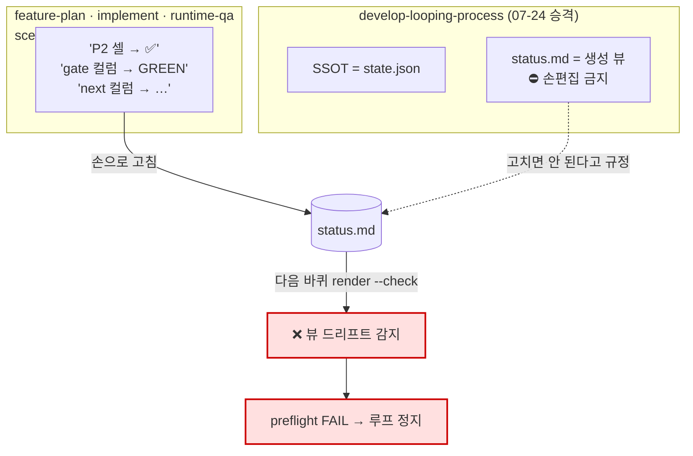
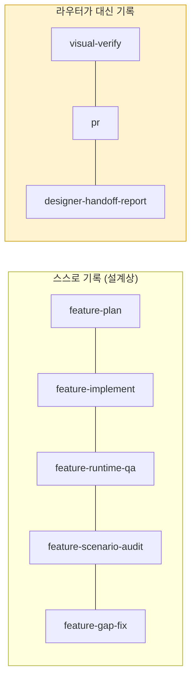
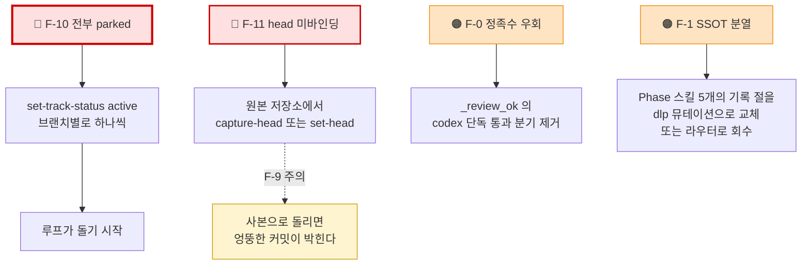

# 분석 — 이관 진단과 실측 (2026-07-30 작성 · 07-31 실측 반영)

`dolomood-app-renew` 의 `feat/home` 워크트리에서 이 저장소로 가져온 뒤, 코드·문서를 읽어
확인한 사실과 **실제 상태 파일을 돌려 계측한 결과**를 적는다. 아직 아무것도 고치지 않았다.

> **정정 이력 (07-31).** 초판은 F-0·F-1 을 최우선 🔴 로 올렸다. 위험도만 보고 **실제로
> 발생 중인지는 확인하지 않은** 판단이었다. 실측해 보니 둘 다 아직 발동하지 않은 잠재
> 결함이었고, 현재 루프를 실제로 막고 있는 것은 따로 있었다(F-10·F-11). 아래는 실측 후
> 재정렬한 판이다.

## 목차

1. [가져온 것](#1-가져온-것)
2. [실측 — 지금 실제로 어떤 상태인가](#2-실측--지금-실제로-어떤-상태인가)
3. [🔴 F-10 트랙 전부 parked — 현재 최대 블로커](#3--f-10-트랙-전부-parked--현재-최대-블로커)
4. [🔴 F-11 head 미바인딩으로 완료가 막힌 트랙](#4--f-11-head-미바인딩으로-완료가-막힌-트랙)
5. [🟠 F-0 정족수 우회 (잠재)](#5--f-0-정족수-우회-잠재)
6. [🟠 F-1 상태 SSOT 분열 (잠재)](#6--f-1-상태-ssot-분열-잠재)
7. [🟡 F-2 ledger-blind 비대칭](#7--f-2-ledger-blind-비대칭)
8. [🟡 F-3 프로젝트 결합](#8--f-3-프로젝트-결합)
9. [🟡 F-7~F-9 코드 레벨 결함](#9--f-7f-9-코드-레벨-결함)
10. [🟢 F-4~F-6 관찰 사항](#10--f-4f-6-관찰-사항)
11. [개선 후보 우선순위](#11-개선-후보-우선순위)

---

## 1. 가져온 것

| 분류 | 항목 | 비고 |
|---|---|---|
| 오케스트레이터 | `develop-looping-process` | 라우터 |
| Phase 스킬 | `feature-plan`(P1) `feature-implement`(P2) `feature-runtime-qa`(P4) `feature-scenario-audit`(P5) `feature-gap-fix`(P6) | |
| 종단 | `designer-handoff-report` | 판정 아님 |
| 호출되는 기존 스킬 | `visual-verify`(P3) `pr`(P7) `ga4-instrument` `figma-sync` | |
| 검증 에이전트 | `isolated-adversarial-verifier` `runtime-qa-verifier` | |
| 상태머신 도구 | `scripts/dlp.py` (1,597줄, stdlib only) | |
| 설계 문서 | `development-process.md`(27K) `dlp-state-machine-design.md`(44K) `spec-orchestration.md` `KICKOFF` `screen-visual-verify-process.md` | |

**원본은 건드리지 않았다** — 복사만 했다. `dolomood-app-renew` 는 그대로 동작한다.

> ⚠️ 복사 중 `skills/figma-sync/.env`(실제 Figma PAT)가 딸려와 즉시 삭제했다.
> 원본 `.env` 는 무사하다. `cp -a` 가 숨김파일을 함께 옮긴다는 점에 주의.

## 2. 실측 — 지금 실제로 어떤 상태인가

원본 저장소의 진짜 `state.json` 을 대상으로 **읽기 전용 명령만** 돌렸다.

```bash
cd dolomood-app-renew-home
python3 scripts/dlp.py validate      # → VALIDATE OK
python3 scripts/dlp.py render --check # → RENDER --check OK
python3 scripts/dlp.py selftest      # → SELFTEST OK (40+ cases + CLI e2e)
python3 scripts/dlp.py route         # → 6개 브랜치 전부 STOP
```

| 계측 항목 | 결과 | 의미 |
|---|---|---|
| 상태 불변식 | ✅ OK | state.json 이 성하다 |
| 뷰 드리프트 | ✅ 없음 | **F-1 은 아직 발동하지 않았다** |
| 라우팅 회귀 | ✅ OK | route 계산이 정상 |
| codex 단독 통과 증거 | **0건** | **F-0 은 아직 발동하지 않았다** |
| 리뷰 증거 | 2건 (검사자 3명 · 6명) | 정족수를 실제로 채웠다 |
| 트랙 상태 | **14개 전부 `parked`** | ← 현재 블로커 |
| `route` 판정 | 6개 브랜치 전부 `STOP` | 루프가 시작을 못 한다 |

**결론 — 상태 파일 자체는 건강하다.** 손상되거나 어긋난 곳이 없다. 그런데도 루프가
안 도는 이유는 아래 두 가지다.

## 3. 🔴 F-10 트랙 전부 parked — 현재 최대 블로커

```
feat/emotion-conv-contract-resync: STOP — 모든 트랙 parked — activate 결정 필요
feat/home-mypage:                  STOP — 모든 트랙 parked — activate 결정 필요
feat/settings:                     STOP — 모든 트랙 parked — activate 결정 필요
feature/emotion-conv-timestamp:    STOP — 모든 트랙 parked — activate 결정 필요
feature/emotion-conversation-ai-server: STOP — 모든 트랙 parked — activate 결정 필요
pcs-fmmc/bag-view-toggle:          STOP — 모든 트랙 parked — activate 결정 필요
```

트랙 14개가 **하나도 빠짐없이 `parked`** 다. `active` 가 0개다.

route 는 브랜치마다 active 트랙 하나를 골라 다음 액션을 계산한다. 고를 대상이 없으니
전부 STOP 이다. **이게 "루프가 안 돈다"의 현재 진짜 원인이다.**

왜 이렇게 됐나 — `SKILL.md` 의 마이그레이션 절이 이렇게 규정한다.

> **추정 금지** — 모호·모순은 `unknown`/needs_human 으로 표면화하고, 사람이 state.json 을
> 저작한다(활성화·counts 확정·리비전 manifest 결정). 어떤 트랙도 산출물만 보고 `done` 으로
> 자동확정하지 않는다.

즉 07-24 마이그레이션이 **설계대로** 전부 `parked` + `unknown` 으로 내려놓았고, 그다음에
와야 할 **사람의 활성화 결정이 오지 않은 채 그대로 남아 있다.** 버그가 아니라 미완의
인수인계다. 다만 그 상태로 방치되면 루프는 영원히 STOP 이다.

**해소 방법은 명령 한 줄이다.**

```bash
python3 scripts/dlp.py set-track-status <track-id> active
```

한 브랜치에 active 는 1개만 허용되므로(I-B), 브랜치별로 하나씩 고르면 병렬로 돌릴 수 있다.

## 4. 🔴 F-11 head 미바인딩으로 완료가 막힌 트랙

`emotion/ai-direct` 는 사실상 끝나 있다.

| P1 | P2 | P3 | P4 | P5 | P6 | counts |
|---|---|---|---|---|---|---|
| pass (logic·ui) | pass (logic·ui) | skip (`visual_exempt=True` ✅) | pass | pass (streak 2) | pass | 0 / 0 |

그런데 완료로 넘어가지 못한다. `dlp.py:220-224` 때문이다.

```python
def _head_ok(rev):
    head = _d(rev.get("exec")).get("head_commit")
    if not isinstance(head, str) or not head:
        return False                    # ← 여기서 걸린다
```

이 트랙의 `exec` 에는 `{"branch": "feature/emotion-conversation-ai-server"}` 만 있고
**`head_commit` 이 없다.** 완료 판정은 "P2 게이트와 P3~P5 최신 리뷰가 **현재 커밋에
묶여 있을 것**"을 요구하는데(R3, stale 통과 차단), 그 커밋이 기록되지 않았다.

`capture-head` 나 `set-head` 를 한 번 돌리면 풀릴 가능성이 높다.

> ⚠️ **F-9 주의.** `capture-head` 는 `dlp.py` 파일 위치를 기준으로 git 을 실행한다.
> 이 저장소에 복사된 사본으로 돌리면 **`custom_skills` 의 커밋 해시**가 박힌다.
> 반드시 **원본 저장소의 `scripts/dlp.py`** 로 돌려야 한다.

## 5. 🟠 F-0 정족수 우회 (잠재)

**아직 발생하지 않았다** — 실측에서 codex 단독 통과 증거 0건. 하지만 코드에 구멍이 있다.

7개 스킬이 전부 같은 정책을 달고 있고, Phase 스킬들은 한 번 더 못 박는다.

> codex 는 hang 등으로 빠질 수 있으니 정족수 3 을 채우는 표로 세지 않는다
> — **격리 에이전트만으로 ≥3 이어야 한다.**

`dlp.py:169-176` 의 실제 판정은 반대다.

```python
def _review_ok(e):
    if not e or e.get("verdict") != "SOUND":
        return False
    if e.get("codex") is True:          # ← 여기서 즉시 통과
        return True
    vc = e.get("verifier_count")
    return isinstance(vc, int) and not isinstance(vc, bool) and vc >= REVIEW_MIN
```



`codex: true` 한 표만 있으면 격리 검증자가 **0명이어도** 통과한다. `has_review()` 가
P3·P4·P5 판정에 쓰이므로 세 층 전부에 적용된다.

**위험의 성격이 다르다** — 다른 결함은 루프를 *멈춘다*. 이건 멈추지 않고 **통과시킨다.**
자평 금지라는 이 프로세스의 존재 이유가 조용히 뚫린다. 지금까지는 검사자를 제대로
채워 써서 안 밟았을 뿐이다.

| 방향 | 변경 | 영향 |
|---|---|---|
| **정책에 코드를 맞춘다** | `codex is True` 분기 제거, codex 는 별도 필드로 기록만 | 권장. 기존 증거 2건은 이미 정족수를 채워서 재검증 불필요 |
| 코드에 정책을 맞춘다 | 스킬 7개 문구 수정 | 안전장치가 실질적으로 약해진다 — 권하지 않는다 |

## 6. 🟠 F-1 상태 SSOT 분열 (잠재)

**아직 발생하지 않았다** — 실측에서 `render --check` 통과, 드리프트 없음.
하지만 지시문이 어긋나 있어 **Phase 스킬을 실제로 돌리는 순간 터진다.**

`develop-looping-process` 는 2026-07-24 에 SSOT 를 마크다운 표에서 JSON 으로 옮겼다.
그런데 Phase 스킬 5개는 그 승격을 반영하지 않았다.



계량한 근거:

| 스킬 | `status.md` 언급 | `state.json` 언급 | `dlp` 언급 |
|---|---:|---:|---:|
| `develop-looping-process` | 1 | **6** | **14** |
| `feature-plan` | 1 | 0 | 0 |
| `feature-implement` | 3 | 0 | 0 |
| `feature-runtime-qa` | 2 | 0 | 0 |
| `feature-scenario-audit` | 2 | 0 | 0 |
| `feature-gap-fix` | 2 | 0 | 0 |

**시킨 대로 할수록 다음 바퀴가 멈춘다.** 동시에 진짜 상태인 `state.json` 에는 결과가
기록되지 않아, 라우터가 대신 기록해 주지 않으면 진행이 유실된다.

지금 드리프트가 없다는 것은 그동안 라우터가 기록을 소유했거나, 승격 이후 Phase 스킬이
자기 지시문대로 `status.md` 를 고친 적이 없다는 뜻이다.

## 7. 🟡 F-2 ledger-blind 비대칭

`visual-verify`(P3) · `pr`(P7) · `designer-handoff-report`(종단)는 진행판의 존재를
모르는 기존 스킬이다. 이 셋의 전이는 **라우터가 대신 기록**해야 한다.



F-1 과 겹치면 한 트랙의 상태가 두 파일에 쪼개져 들어간다. `feature-runtime-qa` 는 이
비대칭을 스스로 보정하는 휴리스틱까지 갖고 있다 — "P3 셀이 비었는데 visual-verify 를
돌린 흔적(캡처·diff md)이 있으면 P3=✅ 로 보정". 그런 보정이 필요하다는 것 자체가
구조적 취약점의 신호다.

## 8. 🟡 F-3 프로젝트 결합

범용 스킬 저장소로 옮긴 지금 그대로는 다른 곳에서 못 쓴다.

| 결합 지점 | 실태 |
|---|---|
| 문서 경로 | `docs/renew-guide/impl/settings/**` 를 9+7+6회 하드코딩 |
| 도구 경로 | `python3 scripts/dlp.py` — 레포 루트 기준 상대경로 8회. 이 저장소에서는 `skills/develop-looping-process/scripts/dlp.py` 라 그대로는 안 돈다 |
| 코드 경로 | `lib/feature/**` `lib/core/**` — Flutter 전용 |
| 브랜치명 | `feat/settings` 를 정책 블록쿼트에 **리터럴로** 박음 (6개 스킬, 총 9회) |
| 기능 목록 | "설정 9기능"을 `feature-plan`·`feature-scenario-audit` 가 열거 |
| 게이트 명령 | `flutter analyze` `dart run custom_lint` — Flutter 전용 |
| 원본 앱 경로 | `feature-gap-fix` 가 parity 대조용으로 절대경로 참조 |

특히 **브랜치명 리터럴**이 고약하다. `state.json` 의 트랙 모델은 브랜치를 데이터로
다루는데, 스킬 본문은 상수로 다룬다. 실제로 지금 트랙들은 `feat/settings` 외에
`feature/emotion-*`, `feat/home-mypage`, `pcs-fmmc/bag-view-toggle` 등 6개 브랜치에
흩어져 있어, 스킬 문구와 실제가 이미 어긋나 있다.

## 9. 🟡 F-7~F-9 코드 레벨 결함

`dlp.py` 소스를 `SKILL.md` 문구와 대조해 확인한 것들이다. 상세는
[`dlp-tool-reference.md` §9](dlp-tool-reference.md#9-skillmd-설명과-구현의-불일치).

**F-7 · `add-evidence approval` 은 항상 거부된다.** 필수 필드 정의는
`"approval": ["scope", "actor"]` 인데 파서가 `--actor` 를 받지 않는다. 승인 증거는
`approve` 커맨드로만 만들 수 있다.

**F-8 · `render` 는 사이클을 출력하지 않는다.** `SKILL.md` 는 "`dlp render` 가 사이클
롤업·라운드별 상세를 뷰로 뽑는다"고 하지만 `render()` 는 `cycles` 를 읽지 않는다.
"몇 사이클 돌았어" 보고는 `state.json` 을 직접 읽어야 나온다.

**F-9 · `capture-head` 가 엉뚱한 저장소를 볼 수 있다.** `cwd=ROOT` 에서 git 을 실행하는데
`ROOT` 는 `dlp.py` 위치 기준이다. 이 저장소의 사본으로 돌리면 `custom_skills` 의 HEAD 를
읽는다. **F-11 을 고칠 때 정면으로 부딪히는 문제다.**

**추가 불일치 3건** — 서브커맨드 목록에서 `capture-head`·`needs-human`·`add-unknown`·
`resolve-unknown` 누락, P3 skip 이 `visual_exempt is True` 를 요구한다는 점, 새 P2 gate 의
하위 무효화가 **head 가 바뀔 때만** 동작한다는 점.

## 10. 🟢 F-4~F-6 관찰 사항

**F-4 · description 길이.** 이 저장소의 `docs/CONVENTIONS.md` 는 트리거를 3~8개로 추리라고
권하는데 실제는 370~825자다. 다만 7개 스킬이 서로 잡아먹지 않게 경계를 긋는 문장이 길이의
상당 부분이라 **결함이라 단정할 수 없다.** 판단은 실사용 후로 미룬다.

**F-5 · P6 의 `N/A` vs `✅` — 결함 아님(확인 완료).** `dlp.py:211-216` 이 정확히 처리한다.

```python
if phase == "P6":
    s = pstat(rev, "P6")
    og, ns = counts_of(rev)
    if s == "skip":
        return _nnint(og) == 0 and _nnint(ns) == 0
    return s == "pass"
```

같은 자리에서 P3 의 `skip` 도 확인됐다 — `track.visual_exempt is True` 여야 한다.
실측에서 `emotion/ai-direct` 의 `visual_exempt` 가 실제로 `True` 인 것을 확인했다.

**F-6 · 초기화 절차 충돌.** `feature-plan` 은 "진행판 파일이 없으면 9기능 전 행 템플릿을
만든다"고 지시한다. 라우터의 모델은 `dlp add-track` 으로 트랙을 하나씩 추가하는 방식이다.
구 마크다운 시대의 잔재로 보인다.

## 11. 개선 후보 우선순위



| 순위 | 항목 | 성격 | 비용 |
|---|---|---|---|
| 1 | **F-10** 트랙 활성화 | 지금 루프를 막고 있음 | 명령 한 줄 + 어느 기능부터 굴릴지 결정 |
| 2 | **F-11** head 바인딩 | 다 끝난 트랙이 완료를 못 받음 | 명령 한 줄 (F-9 주의) |
| 3 | **F-0** 정족수 우회 | 잠재. 밟으면 조용히 잘못 통과 | 코드 두 줄 삭제 |
| 4 | **F-1** SSOT 분열 | 잠재. Phase 스킬 돌리는 순간 터짐 | 스킬 5개 수정 |
| 5 | F-7~F-9 | 국소 버그 | 각각 작음 |
| 6 | F-2 · F-3 · F-6 | 구조·이식성 | 크다. 급하지 않다 |

**1·2 는 "고친다"기보다 "밀린 결정을 내린다"에 가깝다.** 코드를 안 건드리고 상태만
움직이면 되고, 그것만으로 루프가 다시 돈다. 3·4 는 그다음에 손대도 늦지 않다.

F-1 의 방향은 둘 중 하나다.

| 방향 | 장점 | 단점 |
|---|---|---|
| **A. Phase 스킬이 직접 `dlp` 뮤테이션 호출** | 각 Phase 가 자기 결과를 책임짐. 단독 호출도 정합 | 스킬 5개 수정. Phase 스킬이 도구에 결합 |
| **B. 기록을 전부 라우터로 회수** | Phase 스킬은 순수 작업자. F-2 비대칭도 자연 해소 | 단독 호출 시 상태가 안 남음 |

`visual-verify`·`pr` 이 이미 B 방식이고 "라우터는 게이트만 강제"라는 원래 설계 의도를
보면 **B 가 설계 일관성에 맞는다.** 다만 Phase 스킬 단독 호출을 실제로 쓰고 있다면 A 가
안전하다. **어느 쪽을 고를지는 단독 호출 빈도에 달렸다.**
