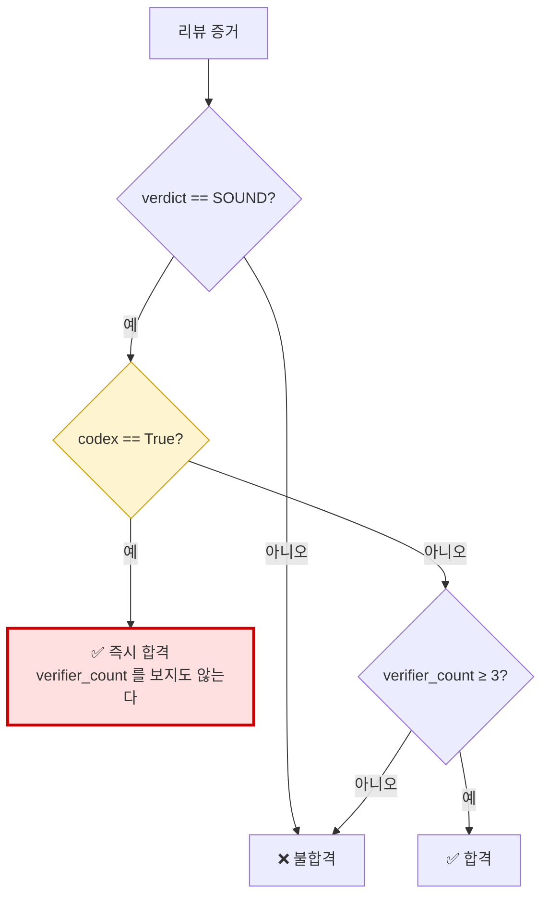
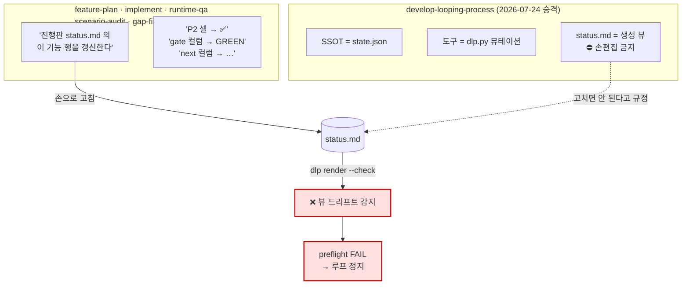
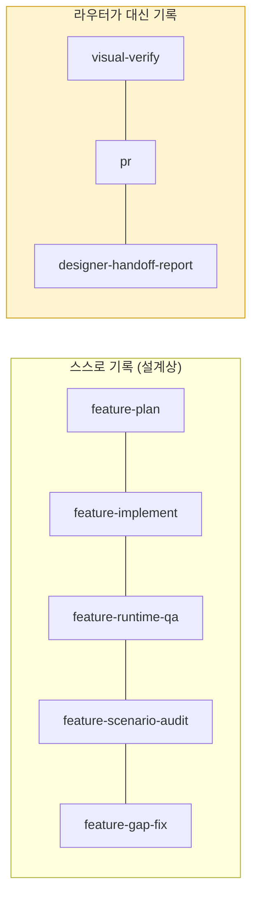
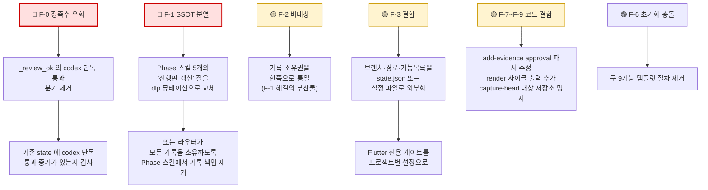

# 1차 분석 — 이관 시점 상태 진단 (2026-07-30)

`dolomood-app-renew` 의 `feat/home` 워크트리에서 이 저장소로 가져온 직후, 코드·문서를
읽어 확인한 사실만 적는다. **아직 아무것도 고치지 않았다.** 개선은 다음 단계다.

## 목차

1. [가져온 것](#1-가져온-것)
2. [🔴 F-0 정족수 우회 — 코드가 정책을 배신한다](#2--f-0-정족수-우회--코드가-정책을-배신한다)
3. [🔴 F-1 상태 SSOT 분열](#3--f-1-상태-ssot-분열)
4. [🟡 F-2 ledger-blind 비대칭](#4--f-2-ledger-blind-비대칭)
5. [🟡 F-3 프로젝트 결합](#5--f-3-프로젝트-결합)
6. [🟡 F-7~F-9 코드 레벨 결함](#6--f-7f-9-코드-레벨-결함)
7. [🟢 F-4~F-6 관찰 사항](#7--f-4f-6-관찰-사항)
8. [개선 후보 우선순위](#8-개선-후보-우선순위)

---

## 1. 가져온 것

| 분류 | 항목 | 비고 |
|---|---|---|
| 오케스트레이터 | `develop-looping-process` | 라우터 |
| Phase 스킬 | `feature-plan`(P1) `feature-implement`(P2) `feature-runtime-qa`(P4) `feature-scenario-audit`(P5) `feature-gap-fix`(P6) | |
| 종단 | `designer-handoff-report` | 판정 아님 |
| 호출되는 기존 스킬 | `visual-verify`(P3) `pr`(P7) `ga4-instrument` `figma-sync` | |
| 검증 에이전트 | `isolated-adversarial-verifier` `runtime-qa-verifier` | |
| 상태머신 도구 | `scripts/dlp.py` (1,597줄, stdlib only) | |
| 설계 문서 | `development-process.md`(27K) `dlp-state-machine-design.md`(44K) `spec-orchestration.md` `KICKOFF` `screen-visual-verify-process.md` | |

**원본은 건드리지 않았다** — 복사만 했다. `dolomood-app-renew` 는 그대로 동작한다.

> ⚠️ 복사 중 `skills/figma-sync/.env`(실제 Figma PAT)가 딸려와 즉시 삭제했다.
> 원본 `.env` 는 무사하다. `cp -a` 가 숨김파일을 함께 옮긴다는 점에 주의.

## 2. 🔴 F-0 정족수 우회 — 코드가 정책을 배신한다

**이 시스템의 핵심 안전장치인 "자평 금지 · 격리 검증자 ≥3 다수결"이 코드에서 무력화된다.**

7개 스킬 전부가 머리에 같은 정책을 달고 있고, Phase 스킬들은 한 번 더 못 박는다.

> codex 는 hang 등으로 빠질 수 있으니 정족수 3 을 채우는 표로 세지 않는다
> — **격리 에이전트만으로 ≥3 이어야 한다.**

그런데 `dlp.py:169-176` 의 실제 판정은 이렇다.

```python
def _review_ok(e):
    if not e or e.get("verdict") != "SOUND":
        return False
    if e.get("codex") is True:          # ← 여기서 즉시 통과
        return True
    vc = e.get("verifier_count")
    return isinstance(vc, int) and not isinstance(vc, bool) and vc >= REVIEW_MIN
```



**결과** — `codex: true` 한 표만 있으면 격리 검증자가 **0명이어도** 그 Phase 리뷰가
통과한다. 정책이 "보너스 표, 정족수에 안 셈"이라고 규정한 바로 그 표가, 코드에서는
**단독 통과권**을 갖는다. 정책과 구현이 정반대다.

`has_review()` 가 P3·P4·P5 판정에 쓰이므로, 이 우회는 시각검증·런타임QA·시나리오감사
**세 층 전부**에 적용된다.

> 이건 "루프가 멈춘다"보다 위험하다. 루프가 **멈추지 않고 통과시킨다.**
> 자평 금지라는 이 프로세스의 존재 이유를 무너뜨린다.

고치는 방향은 둘 중 하나다.

| 방향 | 변경 | 영향 |
|---|---|---|
| **정책에 코드를 맞춘다** | `codex is True` 분기를 제거하고 `verifier_count >= REVIEW_MIN` 만 남긴다. codex 는 별도 필드로 기록만 | 기존 state 에 codex 단독 통과 증거가 있으면 재검증 필요 |
| **코드에 정책을 맞춘다** | 스킬 7개의 "정족수에 안 셈" 문구를 수정 | 안전장치가 실질적으로 약해진다 — **권하지 않는다** |

## 3. 🔴 F-1 상태 SSOT 분열

**오케스트레이터와 Phase 스킬이 서로 다른 파일을 상태로 믿고 있다.**

`develop-looping-process` 는 2026-07-24 에 "검증 가능한 상태 머신"으로 승격되면서
SSOT 를 마크다운 표에서 JSON 으로 옮겼다. 그런데 **Phase 스킬 5개는 그 승격을 반영하지
않았다.**



계량한 근거:

| 스킬 | `status.md` 언급 | `state.json` 언급 | `dlp` 언급 |
|---|---:|---:|---:|
| `develop-looping-process` | 1 | **6** | **14** |
| `feature-plan` | 1 | 0 | 0 |
| `feature-implement` | 3 | 0 | 0 |
| `feature-runtime-qa` | 2 | 0 | 0 |
| `feature-scenario-audit` | 2 | 0 | 0 |
| `feature-gap-fix` | 2 | 0 | 0 |

**왜 이게 루프를 망가뜨리나** — 라우터의 preflight 1단계가
`validate && selftest && render --check` 다. Phase 스킬이 `status.md` 를 손으로 고치면
그 파일은 `dlp render` 결과와 달라지고, 다음 바퀴 `render --check` 가 **드리프트로 감지해
멈춘다**. 즉 **Phase 스킬이 시킨 대로 할수록 다음 바퀴가 멈춘다.**

동시에 실제 상태인 `state.json` 에는 그 결과가 **기록되지 않는다.** 라우터가
`set-phase`·`add-evidence` 로 대신 기록해 주지 않으면 진행이 유실된다.

> 이것이 "develop-looping-process 가 제대로 안 돈다"는 체감의 가장 유력한 원인이다.

## 3. 🟡 F-2 ledger-blind 비대칭

`visual-verify`(P3) · `pr`(P7) · `designer-handoff-report`(종단)는 진행판의 존재를
모르는 기존 스킬이다. 그래서 이 셋의 전이는 **라우터가 대신 기록**해야 한다.



문제는 F-1 과 겹칠 때다. 자기 기록 그룹은 **틀린 파일**(status.md)에 쓰고, 대리 기록
그룹은 라우터가 **맞는 파일**(state.json)에 쓴다. 결과적으로 한 트랙의 상태가 두 파일에
쪼개져 들어간다.

`feature-runtime-qa` 는 이 비대칭을 스스로 보정하는 로직까지 갖고 있다 — "P3 셀이 비어
있는데 visual-verify 를 돌린 흔적(캡처·diff md)이 있으면 P3=✅ 로 보정하고 진행". 이런
휴리스틱 보정이 필요하다는 것 자체가 구조적 취약점의 신호다.

## 4. 🟡 F-3 프로젝트 결합

이 스킬 묶음은 `dolomood-app-renew` 에 강하게 묶여 있다. 범용 스킬 저장소로 옮긴 지금
그대로는 다른 곳에서 못 쓴다.

| 결합 지점 | 실태 |
|---|---|
| 문서 경로 | `docs/renew-guide/impl/settings/**` 를 9+7+6회 하드코딩 |
| 도구 경로 | `python3 scripts/dlp.py` — **레포 루트 기준 상대경로** 8회. 이 저장소에서는 `skills/develop-looping-process/scripts/dlp.py` 에 있어 그대로는 안 돈다 |
| 코드 경로 | `lib/feature/**` `lib/core/**` — Flutter 전용 |
| 브랜치명 | `feat/settings` 를 정책 블록쿼트에 **리터럴로** 박음 (6개 스킬, 총 9회) |
| 기능 목록 | "설정 9기능"(계정·로그인정보·알림·…)을 `feature-plan`·`feature-scenario-audit` 가 열거 |
| 게이트 명령 | `flutter analyze` `dart run custom_lint` — Flutter 전용 |
| 원본 앱 경로 | `feature-gap-fix` 가 parity 대조용으로 `/Users/pcs/…/dolomood-app` 절대경로 참조 |

특히 **브랜치명 리터럴**이 고약하다. "작업 브랜치 `feat/settings` 유지"가 모든 스킬의
정책 블록쿼트에 박혀 있어서, 다른 브랜치에서 돌리면 스킬 지시와 실제가 어긋난다.
`state.json` 의 트랙 모델은 브랜치를 데이터로 다루는데, 스킬 본문은 상수로 다룬다.

## 6. 🟡 F-7~F-9 코드 레벨 결함

`dlp.py` 소스를 `SKILL.md` 문구와 대조해 확인한 것들이다. 상세는
[`dlp-tool-reference.md` §9](dlp-tool-reference.md#9-skillmd-설명과-구현의-불일치).

**F-7 · `add-evidence approval` 은 항상 거부된다.** 필수 필드 정의는
`"approval": ["scope", "actor"]` 인데 파서가 `--actor` 를 받지 않는다. 승인 증거는
`approve` 커맨드로만 만들 수 있다. `add-evidence` 로 승인을 넣으려던 절차는 전부 실패한다.

**F-8 · `render` 는 사이클을 출력하지 않는다.** `SKILL.md` 는 "종단/요청 시 `dlp render`
가 사이클 롤업·라운드별 상세를 뷰로 뽑는다"고 하지만, `render()` 는 `cycles` 를 읽지
않는다. "몇 사이클 돌았어" 보고는 `state.json` 을 직접 읽어야 나온다.

**F-9 · `capture-head` 가 엉뚱한 저장소를 볼 수 있다.** `cwd=ROOT` 에서 `git rev-parse
HEAD` 를 돌리는데, `ROOT` 는 `dlp.py` 위치 기준이다. 이 저장소에 옮겨진 지금
**`custom_skills` 의 HEAD 와 dirty 상태**를 읽는다. 대상 앱과 무관한 변경이 capture 를
막거나, 엉뚱한 커밋 해시가 `@head` 증거로 박힐 수 있다.

**추가로 확인된 불일치 3건** — 서브커맨드 목록에서 `capture-head`·`needs-human`·
`add-unknown`·`resolve-unknown` 누락, P3 skip 이 `visual_exempt is True` 를 요구한다는
점(아무 skip 이 아님), 새 P2 gate 의 하위 무효화가 **head 가 바뀔 때만** 동작한다는 점.

## 7. 🟢 F-4~F-6 관찰 사항

**F-4 · description 길이.** 이 저장소의 `docs/CONVENTIONS.md` 는 트리거 문구를 3~8개로
추리라고 권한다. 실제는 훨씬 길다.

| 스킬 | description 길이 |
|---|---:|
| `develop-looping-process` | 825자 |
| `designer-handoff-report` | 561자 |
| `feature-plan` | 538자 |
| `feature-implement` | 484자 |
| `feature-scenario-audit` | 461자 |
| `feature-runtime-qa` | 429자 |
| `feature-gap-fix` | 370자 |

다만 이건 **결함이라고 단정할 수 없다.** 7개 스킬이 서로 잡아먹지 않게 경계를 긋는 문장
("계획 짜줘는 feature-plan, 구현해줘는 feature-implement")이 길이의 상당 부분이다.
오히려 F-1 을 고칠 때 이 경계 문장들이 좋은 참고가 된다. 판단은 실사용 후로 미룬다.

**F-5 · P6 의 `N/A` vs `✅` — 결함 아님(확인 완료).** `dlp.py:211-216` 이 정확히
처리한다. P6 가 `skip` 이면 `open_gaps == 0` **그리고** `needs_sim == 0` 일 때만 통과로
친다. 즉 "갭 없어서 건너뜀"과 "갭 있는데 건너뜀"을 구분한다.

```python
if phase == "P6":
    s = pstat(rev, "P6")
    og, ns = counts_of(rev)
    if s == "skip":
        return _nnint(og) == 0 and _nnint(ns) == 0
    return s == "pass"
```

같은 자리에서 P3 의 `skip` 도 확인됐다 — 아무 skip 이 아니라 `track.visual_exempt is
True` 여야 한다(문자열 truthy 를 막으려고 `is True` 로 엄격 비교). webview 화면처럼
Figma 정합 대상이 아닌 경우만 면제하려는 의도로 읽힌다.

**F-6 · 초기화 절차 충돌.** `feature-plan` 은 "진행판 파일이 없으면 9기능 전 행 템플릿을
만든다"고 지시한다. 반면 라우터의 모델은 `dlp add-track` 으로 **트랙을 하나씩** 추가하는
방식이다. 전자는 구 마크다운 시대의 잔재로 보인다.

## 8. 개선 후보 우선순위



| 순위 | 항목 | 왜 이 순서인가 |
|---|---|---|
| 1 | **F-0 정족수 우회** | 유일하게 **잘못된 통과**를 만든다. 나머지는 멈추거나 불편할 뿐이다 |
| 2 | **F-1 SSOT 분열** | 루프가 실제로 안 도는 원인 |
| 3 | F-7~F-9 | 국소 버그. 고치기 쉽고 영향 범위가 좁다 |
| 4 | F-2 비대칭 | F-1 을 고치면 대체로 함께 정리된다 |
| 5 | F-3 결합 | 다른 프로젝트로 넓힐 때만 필요. 지금 급하지 않다 |
| 6 | F-6 | 문서 한 줄 |

**F-0 → F-1 순으로 손대는 것을 권한다.** F-0 은 한 줄 수정이고, 고치지 않으면 이 프로세스가
지키려는 것(자평 금지)이 지켜지지 않는다. F-1 은 그다음이다 — 루프가 실제로 멈추는 원인이다.

두 가지 방향이 있고 트레이드오프가 다르다.

| 방향 | 장점 | 단점 |
|---|---|---|
| **A. Phase 스킬이 직접 `dlp` 뮤테이션 호출** | 각 Phase 가 자기 결과를 책임짐. 단독 호출도 정합 | 스킬 5개 수정. Phase 스킬이 도구에 결합 |
| **B. 기록을 전부 라우터로 회수** | Phase 스킬은 순수 작업자. ledger-blind 비대칭 자연 해소 | 단독 호출 시 상태가 안 남음 |

`visual-verify`·`pr` 이 이미 B 방식(라우터 대리 기록)이라는 점, 그리고 "재발명 금지 ·
라우터는 게이트만 강제"라는 원래 설계 의도를 보면 **B 가 설계 일관성에는 더 맞는다.**
다만 Phase 스킬 단독 호출을 실제로 쓰고 있다면 A 가 안전하다.

> 어느 쪽을 고를지는 **Phase 스킬을 단독으로 호출하는 일이 실제로 얼마나 있는지**에 달렸다.
