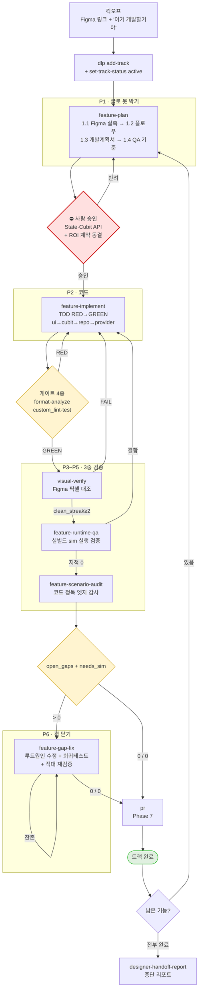
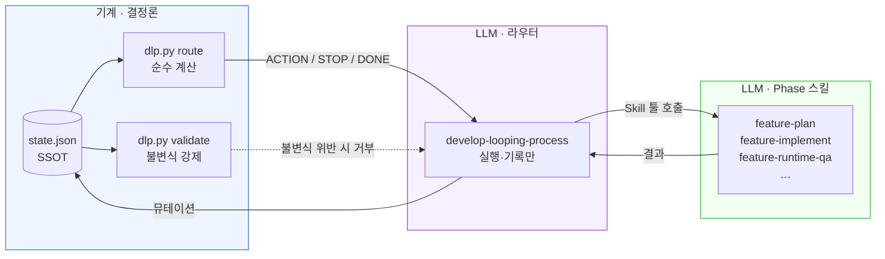
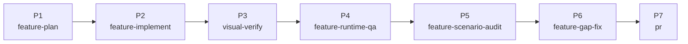
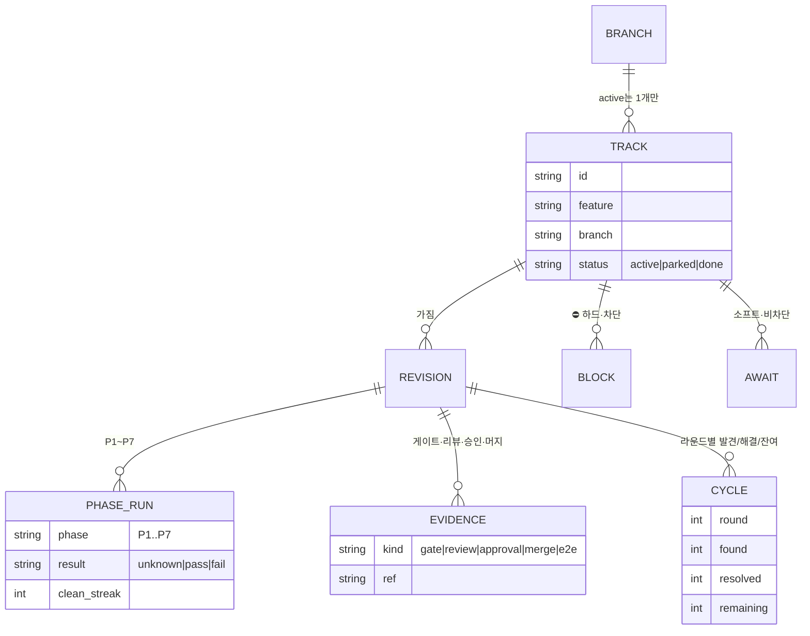
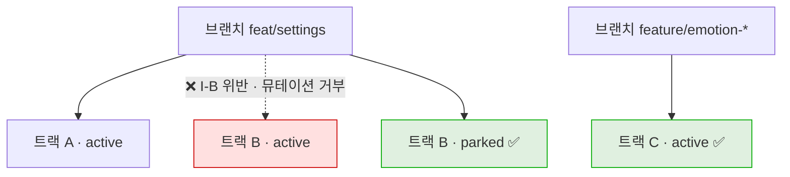
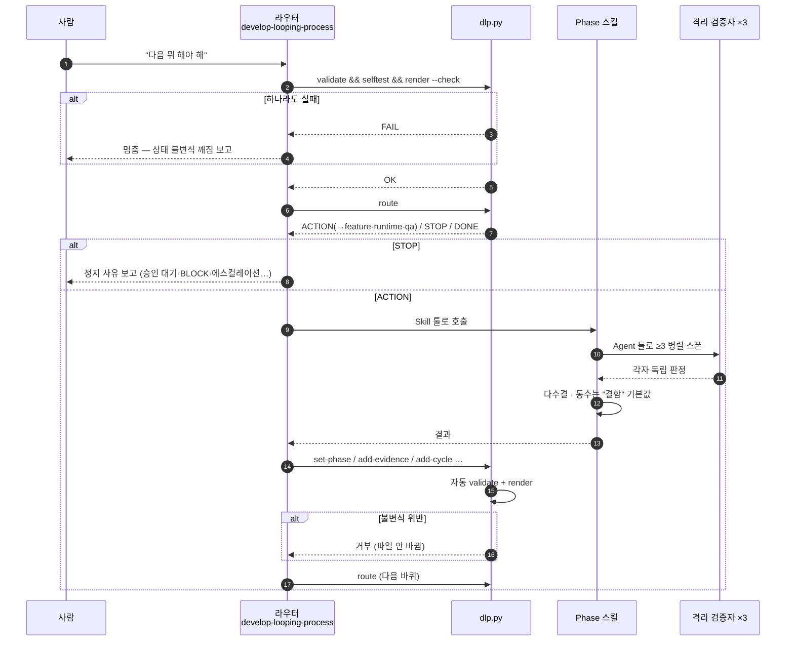
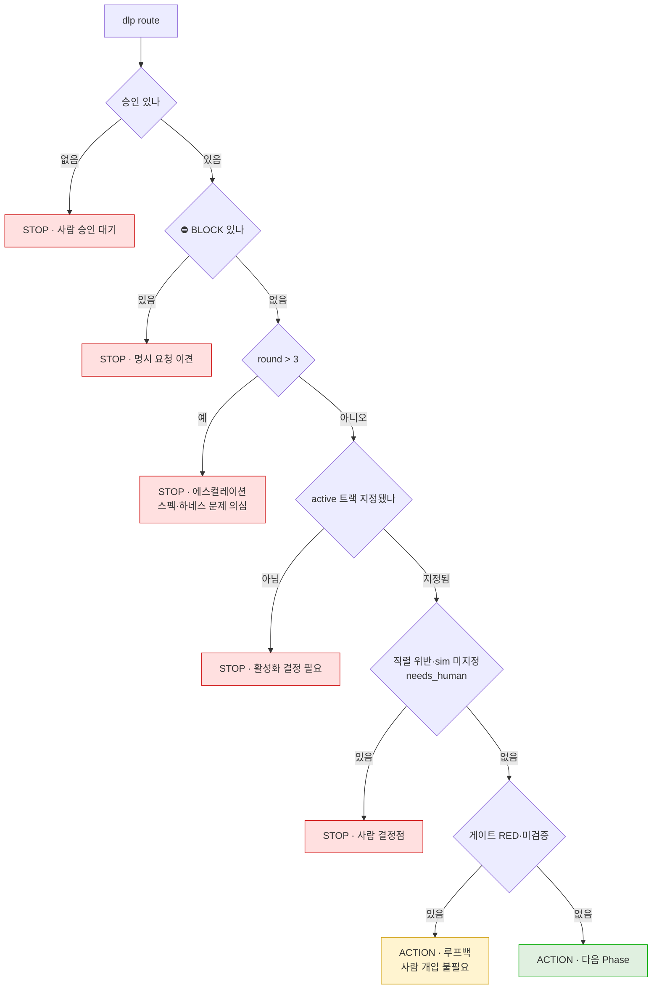
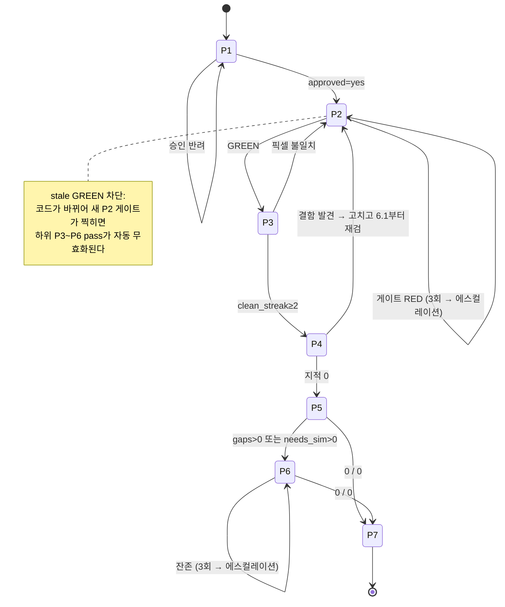
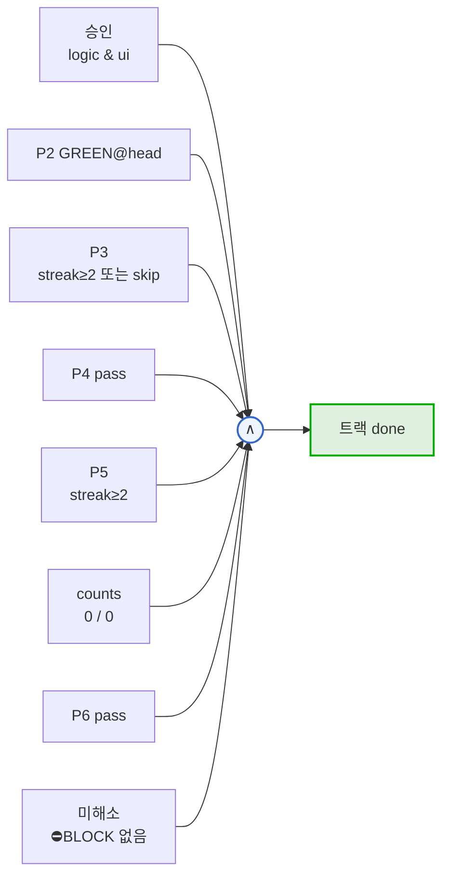

# develop-looping-process 전체 개관 (도식)

기능 하나를 **계획 → 구현 → 시각검증 → QA → 시나리오감사 → 갭수정 → PR** 7단계로
끝까지 굴리는 오케스트레이터. 이 문서는 "이게 어떻게 돌아가는가"를 그림으로 잡는다.

- 개발·QA를 **어떤 방식으로** 하는지 → [`dev-and-qa-model.md`](dev-and-qa-model.md)
- `dlp.py` 도구의 커맨드·불변식 상세 → [`dlp-tool-reference.md`](dlp-tool-reference.md)
- 현재 상태 분석과 개선 후보 → [`findings-2026-07-30.md`](findings-2026-07-30.md)

## 목차

1. [한 장으로 보는 전체 루프](#1-한-장으로-보는-전체-루프)
2. [역할 분리 — 라우터는 판단하지 않는다](#2-역할-분리--라우터는-판단하지-않는다)
3. [7단계와 각 단계의 게이트](#3-7단계와-각-단계의-게이트)
4. [상태 데이터 모델](#4-상태-데이터-모델)
5. [한 바퀴 도는 시퀀스](#5-한-바퀴-도는-시퀀스)
6. [멈추는 지점 — STOP의 종류](#6-멈추는-지점--stop의-종류)
7. [루프백 — 되돌아가는 경로](#7-루프백--되돌아가는-경로)
8. [완료 판정](#8-완료-판정)

---

## 1. 한 장으로 보는 전체 루프

**빨간 게이트(P1 승인)만 사람이 연다.** 나머지 노란 게이트는 실패해도 사람을 부르지 않고
루프백한다 — 이게 "루핑"의 핵심이다.

## 2. 역할 분리 — 라우터는 판단하지 않는다

이 시스템의 설계 요점은 **판정을 LLM에서 순수 함수로 빼낸 것**이다.

| 주체 | 하는 일 | 안 하는 일 |
|---|---|---|
| `dlp.py` | 다음 액션 **계산**, 불변식 강제, 뷰 렌더 | 코드·문서 작성 |
| 오케스트레이터 | 계산 결과대로 스킬 **호출**, 결과 **기록** | 단계 절차를 스스로 판단 |
| Phase 스킬 | 그 단계의 실제 작업 | 자기 작업의 합격 판정 |
| 격리 검증자 | 적대적 판정 (≥3 다수결) | 코드 수정 |
| 사람 | P1 승인, BLOCK 해소, 에스컬레이션 대응 | 매 단계 개입 |

> **재발명 금지 원칙** — 각 Phase가 "무엇을 어떻게" 하는지는 Phase 스킬이 소유한다.
> 라우터는 그 절차를 자기 파일에 복붙하지 않는다.

## 3. 7단계와 각 단계의 게이트

| Phase | 스킬 | 산출 | 통과 조건 | 진행판을 스스로 갱신? |
|---|---|---|---|---|
| P1 | `feature-plan` | 이해도 문서, 승인 스펙, `<f>.rois.json`, QA 기준 | **사람 승인** → API·ROI 동결 | 예 (`approved` 기록은 P1 몫) |
| P2 | `feature-implement` | `lib/feature/<f>/` 전 레이어 + 테스트 | 게이트 4종 GREEN + RED 증거 + 키노출 preflight | 예 |
| P3 | `visual-verify` | Figma 대조 캡처·diff | **clean_streak ≥ 2** | ❌ **라우터가 대신 기록** |
| P4 | `feature-runtime-qa` | `<f>.md §QA-P4` | 열린 지적 0 (격리 ≥3 다수결) | 예 |
| P5 | `feature-scenario-audit` | `scenario-gaps.md` | 판정 완료 (수렴 2연속) | 예 |
| P6 | `feature-gap-fix` | 수정 코드 + 회귀 테스트 | `open_gaps=0` **그리고** `needs_sim=0` | 예 |
| P7 | `pr` | PR | 머지 | ❌ **라우터가 대신 기록** |

> **ledger-blind 스킬** — `visual-verify`(P3)·`pr`(P7)·`designer-handoff-report`(종단)는
> 진행판의 존재를 모르는 기존 스킬이다. 그래서 이 셋의 전이는 **라우터가 소유해서 기록**한다.
> 이 비대칭이 버그의 단골 출처다.

## 4. 상태 데이터 모델

**직렬성 규칙이 여기 박혀 있다.**

한 브랜치에 active 트랙은 **1개**. 브랜치가 다르면 병렬 OK — 이 설계가 초기 버전의
"전역 직렬" 데드락을 푼 지점이다.

## 5. 한 바퀴 도는 시퀀스

**5번과 6번 사이가 이 시스템의 심장이다** — LLM이 "다음은 P4겠지"라고 추측하지 않고
순수 함수가 계산한 결과를 받는다.

## 6. 멈추는 지점 — STOP의 종류

**결정적 구분** — 게이트 RED는 STOP이 **아니다**. 사람을 부르지 않고 P2로 루프백한다.
사람이 불려 나오는 건 위 5가지 빨간 경우뿐이다.

> ⛔BLOCK vs AWAIT
> - `add-block` = **하드**. 사용자 명시 요청과 판단이 충돌. 해소 전엔 트랙 done 불가.
> - `add-await` = **소프트**. 외부 대기(BE·디자이너). 진행을 막지 않는다.
>
> 명시 요청 미반영을 "이미 정상"으로 강등·은폐하는 것이 금지 대상이다.

## 7. 루프백 — 되돌아가는 경로

**stale GREEN 차단**이 이 상태머신에서 가장 미묘한 규칙이다. P5까지 갔다가 P2로
루프백해 코드를 고치면, 이미 통과했던 P3·P4·P5가 **자동으로 무효화**된다.
"아까 통과했으니 넘어가자"가 구조적으로 불가능하다.

## 8. 완료 판정

`completion_predicate` — route와 validator가 **공유하는 단일 술어**다.
어느 하나도 산출물만 보고 추정하지 않는다.

여덟 개 **전부** 참이어야 완료다. `@head`는 "현재 커밋 기준"이라는 뜻으로,
코드가 바뀌면 다시 찍어야 한다.
